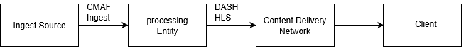
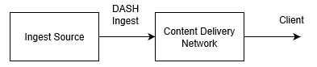
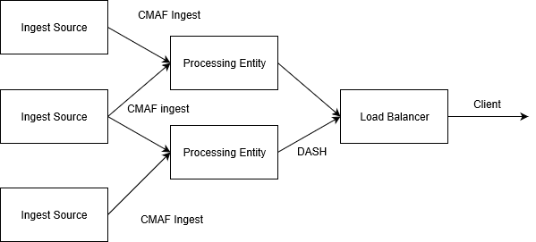
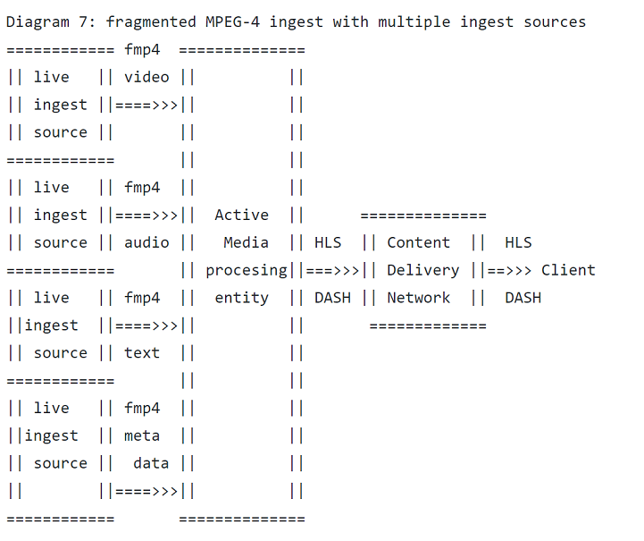
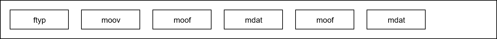
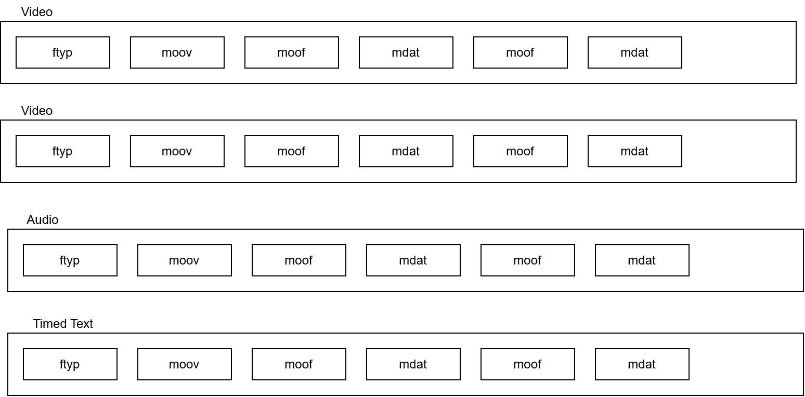
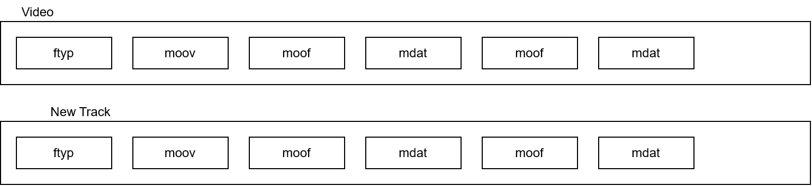
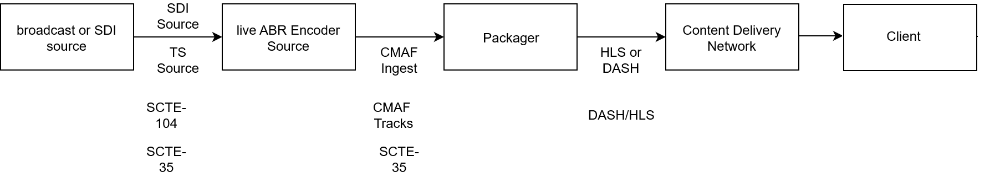
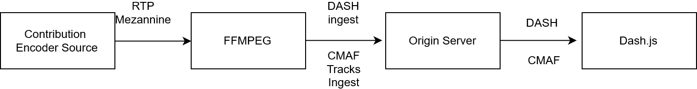

#include "00-CommunityReview.inc.md"

#Specification: Live Media Ingest # {#IngestSpec}

## Abstract ## {#Abstract}

   This document presents the DASH-IF Live Media Ingest Protocol Specification. 
   Two protocol interfaces are defined. The first, interface 1, CMAF ingest, 
   is based on fragmented MPEG-4 as defined in the common media application track format (CMAF). 
   The second interface is based on MPEG DASH and HLS.
   Both Interfaces use the HTTP POST Method to transmit media objects 
   from the ingest source to the receiving entity. Examples of live streaming workflows using these
   protocol interfaces are also presented. The protocol interfaces also support carriage of timed metadata and timed text. 
   Guidelines for redundancy and failover are also included.

## Copyright Notice and Disclaimer ## {#CopyRights}

Please review these documents  
   carefully, as they describe your rights and restrictions with  
   respect to this document.  Code Components extracted from this  
   document must include Simplified BSD License text as described  
   in Section 4.e of the Trust Legal Provisions and are provided  
   without warranty as described in the Simplified BSD License  

This is a document made available by DASH-IF. The technology
embodied in this document may involve the use of intellectual
property rights, including patents and patent applications owned
or controlled by any of the authors or developers of this document.
No patent license, either implied or express, is granted to you by
this document. DASH-IF has made no search or investigation for such
rights and DASH-IF disclaims any duty to do so. The rights and obligations
 which apply to DASH-IF documents, as such rights and obligations are set
 forth and defined in the DASH-IF Bylaws and IPR Policy including,
 but not limited to, patent and other intellectual property license
 rights and obligations. A copy of the DASH-IF Bylaws and IPR Policy
 can be obtained at http://dashif.org/.

The material contained herein is provided on an AS IS basis and to the   
maximum extent permitted by applicable law, this material is provided   
AS IS, and the authors and developers of this material and DASH-IF   
hereby disclaim all other warranties and conditions, either express,
implied or statutory, including, but not limited to, any (if any) implied  
warranties, duties or conditions of merchantability,
of fitness for a particular purpose, of accuracy or completeness of responses,
of workmanlike effort, and of lack of negligence.
In addition, this document may include references to documents and/or   
technologies controlled by third parties.
Those third party documents and technologies may be subject to third party   
rules and licensing terms. No intellectual property license, either implied or express,
to any third party material is granted to you by this document or DASH-IF.   
DASH-IF makes no warranty whatsoever for such third party material.

# Introduction # {#Introduction}

   The main goal of this specification is to define the
   interoperability point between an [=Ingest Source=]
   and a [=Receiving entity=] that typically reside
   in the cloud or the network. This specification does
   not impose any new constraints or requirements to clients
   that consume streams using any defined
   streaming protocol, with a preference for [[!MPEGDASH]]

   Live media ingest happens between an [=Ingest source=], such as a [=Live encoder=] and a [=Receiving entity=].
   Examples of such a [=Receiving entity=] could be a media packager, streaming origin or a Content Delivery Network.
   The combination of ingest sources and receiving entities  
   is common in practical video streaming deployments.  
   In such deployments, media processing functionality is distributed between the ingest source and receiving entities.

   Nevertheless, in such deployments, interoperability between  
   ingest sources and downstream processing  
   entities can sometimes be challenging.  
   This challenge comes from the fact that  
   there are multiple levels of interoperability to be considered.
   This challenge also comes from the fact that each vendor has a
   different view of what is expected/preferred as well as how various
   technical specifications apply.

   For example, the network protocol for transmission  
   of data and the setup of the connectivity are important.  
   This includes schemes for establishing the ingest  
   connection, handling disconnects and failures,  
   providing procedures for reliably sending
   and receiving the data, and timely resolution of hostnames.  

   A second level of interoperability lies  
   with the media container and coded media formats.  
   The Moving Picture Experts Group defines several media  
   container formats such as [[!ISOBMFF]] and [[!MPEG2TS]]
   which are widely adopted and well supported.  
   However, these are general purpose formats,  
   targeting several different application areas.  
   To do so, they provide many different profiles and options.  
   Detailed interoperability is often achieved through  
   other application standards such as those for  
   broadcast, storage, or video on demand. For interoperable
   live media ingest, this document provides
   guidance on how to use [[!ISOBMFF]] and [[!MPEGCMAF]] for 
   formatting the media content.  

   In addition, the codec and profile used,
   e.g. [[!MPEGHEVC]] are important  
   interoperability points that themselves also  
   have different profiles and different
   configurations. This specification
   provides some guidance on how encoded
   media should be represented and transmitted.

   A third level of interoperability, lies in the way metadata is  
   inserted in streams. Live  
   content often needs such metadata to signal  
   opportunities for ad insertion, program information,  
   or other attributes like timed graphics or general
   information relating to the broadcast. Examples  
   of such metadata formats include [[!SCTE35]] markers which  
   are often found in broadcast streams and other  
   metadata such as ID3 tags [[!ID3v2]] containing information
   relating to the media presentation.

   In fact, many more types of metadata relating
   to the live event might be ingested and passed
   on to an over-the-top (OTT) streaming workflow.  

   Fourth, for live media, handling the timeline  
   of the presentation consistently is important.  
   This includes sampling of the media, avoiding  
   timeline discontinuities and synchronizing  
   timestamps attached by different ingest sources
   such as audio and video. In addition, media
   timeline discontinuities must be avoided as much as
   possible during normal operation. Further, when
   using redundant ingest sources, the ingested streams 
   must be accurately synchronized in a sample accurate manner.
   Last, streams may need to be started at the same
   time so as to avoid misalignment between audio and video
   tracks.

   Fifth, in streaming workflows it is important  
   to have support for failovers of both the ingest sources  
   and Receiving entities. This is important  
   to avoid interruptions of 24/7 live services such  
   as Internet television where components may fail occasionally.

   In practical deployments, multiple ingest sources  
   and Receiving entities are often used. This requires  
   that multiple ingest sources and receiving processing
   entities work together in a redundant workflow where  
   some of the components might fail. Well defined
   failover behavior will help interoperability.

   This document provides a specification
   for establishing these interoperability points.
   The approaches are based on known standardized  
   technologies that have been tested and deployed  
   in several large-scale streaming deployments.

   To address this interoperability point, two key interfaces 
   and their protocol specification have been identified.
   The first, CMAF Ingest, mainly functions as an ingest format to a packager
   or active media processor, while the second works mainly
   to ingest media streaming presentations to origin servers,
   cloud storage or Content Deliery Networks.

   The section on interfaces and profiles provides more
   background and motivation around these two interfaces
   that both use HTTP POST.   

   We further motivate the specification  
   in this document supporting    
   HTTP 1.1 [[!RFC7235]]  and [[!ISOBMFF]].   
   We believe that Smooth streaming [=MS-SSTR=]   
   and HLS [[!RFC8216]] have shown that HTTP usage
   can survive the Internet ecosystem for   
   media delivery. In addition, HTTP-based   
   ingest fits well with current HTTP   
   based streaming protocols including [[!MPEGDASH]].   
   In addition, there is good support for HTTP   
   middle-boxes and HTTP routing available   
   making it easy to debug and trace errors.   
   The HTTP POST provides a push-based   
   method for delivering the   
   live content when it becomes available.  

   Regarding the transport protocol, in future versions,  
   alternative transport protocols could be considered  
   advancing over HTTP 1.1 or TCP.
   We believe the proposed media format and protocol interfaces
   will provide the same benefits with other transport
   protocols. Our view is that for current and near future  
   deployments, using [[!RFC7235]] is still a good approach.   

   The document is structured as follows, section 3   
   presents the conventions and terminology used throughout   
   this document. Section 4 presents use cases and   
   workflows related to media ingest and the two profiles/interfaces   
   presented. Sections 5-9 will detail the two different protocol interfaces defined.   

# Conventions and Terminology # {#conventions}

   The following terminology is used in the rest of this document.  

   The key words "MUST", "MUST NOT", "REQUIRED", "SHALL", "SHALL NOT",    
   "SHOULD", "SHOULD NOT", "RECOMMENDED", "MAY", and "OPTIONAL" in this    
   document are to be interpreted as described in BCP 14, RFC 2119   
   [[RFC2119]].   

   <dfn dfn> **ABR** </dfn>:
          Adaptive Bit-Rate

   <dfn dfn> **CMAF Header** </dfn>:
             CMAF track header defined in [[!MPEGCMAF]]

   <dfn dfn> **CMAF Media object** </dfn>:
             CMAF media object defined in [[!MPEGCMAF]], a cmaf chunk, segment, fragment or track

   <dfn dfn> **CMAF fragment** </dfn>:
             CMAF fragment defined in [[!MPEGCMAF]]

   <dfn dfn> **CMAF chunk** </dfn>:
             CMAF chunk defined in [[!MPEGCMAF]]

   <dfn dfn> **CMAF segment** </dfn>:
             CMAF segment defined in [[!MPEGCMAF]]
   
   <dfn dfn> **CMAFstream**  </dfn>:
             byte-stream that follows the CMAF track format structure format
             defined in [[!MPEGCMAF]] between ingest source and receiving entity.
             Due to error control behavior such as retransmission of CMAF fragments 
             and Headers a cmaf stream may not fully conforming CMAF track file. 
             The receiving entity can filter out retransmitted fragments and 
             headers and restore a valid CMAF track file from the cmaf stream.

   <dfn dfn>**CMAF Track**</dfn>
             CMAF Track defined in [[!MPEGCMAF]]

   <dfn dfn>**CMAF Ingest**</dfn>:
            Ingest interface defined in this specification for push based [[!MPEGCMAF]]
   
   <dfn dfn>**Connection**</dfn>:
              A connection setup between two hosts, typically the  
              media [=Ingest source=] and [=Receiving entity=]. 

   <dfn dfn>**DASH Ingest**</dfn>:
            Ingest interface defined in this specification for push based [[!MPEGDASH]]

   <dfn dfn>**HLS Ingest**</dfn>:
          Ingest interface defined in this specification for push based [[!RFC8216]]

   <dfn dfn> **HTTP POST** </dfn>:  
             Command used in the Hyper Text Transfer Protocol for  
             sending data from a source to a destination [[!RFC7235]]
   
   <dfn dfn>**Ingest source**</dfn>:  
            A media source ingesting live media content to a receiving entity  
            , it is typically a live encoder but not restricted  
            to this, e.g. it could be a stored media resource.

   <dfn dfn>**Ingest Stream**</dfn>:
          The stream of media pushed from the ingest source to the Receiving entity  
    
   **ISOBMFF**: 
   
         the ISO Base Media File Format specified in [[!ISOBMFF]]

   <dfn dfn>**Live stream session**</dfn>:  
           The total live stream for the ingest relating to a broadcast event.

   <dfn dfn>**Live encoder**</dfn>:
           Entity performing live  
           encoding of a high quality
           Ingest stream,  
           can serve as ingest source  

   <dfn dfn>**Manifest objects**</dfn>
           Objects ingested that represent streaming manifest
	        e.g. .mpd in MPEG DASH, .m3u8 in HLS

   <dfn dfn> **Media objects** </dfn>
           Objects ingested that represent the media, and or
	        timed text, or other non manifest objects, typically
           these are CMAF addressable media objects such as
           CMAF chunks, fragments or segments.

   <dfn dfn> **Media fragment** </dfn>
             Media fragment, combination of "moof" and "mdat" in
             ISOBMFF structure (MovieFragmentBox and mediaDataBox),
             can be a CMAF fragment or chunk. A media fragment may include 
             top level boxes defined in CMAF fragments such as emsg, prft and 
             styp. 

   <dfn dfn> **Objects** </dfn>
           [=Manifest objects] or [=Media objects=]

   <dfn dfn>**Publishing point**</dfn>:
              Entry point used to receive an ingest stream,  
              consumes/receives the incoming media [=ingest stream=],
              typically via a publishing URL setup to receive the stream
   
   <dfn dfn> **POST_URL**  </dfn>:
            Target URL of a POST command in the HTTP protocol  
             for posting data from a source to a destination. 
             The POST_URL is known by both the ingest source and 
             receiving entity. The POST_URL basepath is setup by the receiving 
             entity. The ingest source may add extended paths to signal 
             track names, fragment names or segment names.

   <dfn dfn>**Receiving entity**</dfn>:
          Entity used to receive the media content,  
          receives/consumes an [=Ingest stream].

   <dfn dfn>**Streaming presentation**</dfn>
           set of [=Objects=] composing
	        a Streaming presentation based on a streaming protocol such
           as for example [[!MPEGDASH]]

   <dfn dfn>**Switching set**</dfn>:
           Group of tracks corresponding to a switching set defined in
           [[!MPEGCMAF]] or an adaptation-set in [[!MPEGDASH]]
    
   <dfn dfn>**Switching Set ID**</dfn>
          Identifier generated by a live ingest source to group CMAF tracks
	  in a switchingset. The Switching Set ID is unique for each switchingset 
	  in a live streaming session.
    
   <dfn dfn>**TCP**</dfn>:
           Transmission Control Protocol (TCP) as defined in [[!RFC793]]  

   <dfn dfn>**RTP** </dfn>:
         Real Time Protocol

   <dfn dfn>**OTT** </dfn>:
         Over the top transmission, i.e. HTTP based video streaming  

   <dfn dfn>**moof**</dfn>:
           The MovieFragmentBox "moof" box as defined in the  
           ISOBMFF  base media file format [[!ISOBMFF]] that defines
           the index information of samples in a fragment.  

   <dfn dfn>**ftyp**</dfn>:
          The FileTypeBox "ftyp" box as defined
          in the ISOBMFF [[!ISOBMFF]]

   <dfn dfn>**moov**</dfn>:
           The container box for all metadata MovieBox "moov" defined in the  
           ISOBMFF base media file format [[!ISOBMFF]]

   <dfn dfn> **mdat**  </dfn>:
           The mediaDataBox "mdat" box defined in
            ISOBMFF [[!ISOBMFF]].

   <dfn dfn>**mfra**</dfn>:
            The movieFragmentRandomAccessBox "mfra" box defined in  
            the ISOBMFF [[!ISOBMFF]] to signal random access samples  
            (these are samples that require no prior  
            or other samples for decoding) [[!ISOBMFF]].  

   <dfn dfn> **tfdt** </dfn>:
            The TrackFragmentBaseMediaDecodeTimeBox box "tfdt"  
            defined in  [[!ISOBMFF]] used  
            to signal the decode time of the media  
            fragment signalled in the [=moof=] box.  

   <dfn dfn> **basemediadecodetime** </dfn>:
            Decode time of first sample as signalled in the [=tfdt=] box

   <dfn dfn> **mdhd**  </dfn>:
             The MediaHeaderBox "mdhd" as defined in [[!ISOBMFF]],  
             this box contains information about the media such  
             as timescale, duration, language using ISO 639-2/T [[!iso-639-2]] codes  
             [[!ISOBMFF]]

   <dfn dfn> **elng** </dfn>:  
             Extended language tag box "elng" defined in [[!ISOBMFF]] that  
             can override the language information  

   <dfn dfn> **nmhd** </dfn>:  
             The nullMediaHeaderBox "nmhd" as defined in [[!ISOBMFF]]  
             to signal a track for which no specific  
             media header is defined, used for metadata tracks  

# Media Ingest Workflows and Interfaces # {#workflow_and_use_cases}

   Two workflows have been identified mapping to the two protocol interfaces.

   The first workflow uses a separate live encoder as [=Ingest source=]
   and packager as [=Receiving entity=]. In this case, interface 1,
   [[!MPEGCMAF]] (CMAF) Ingest may be used. This interface uses
   [[!MPEGCMAF]] to ingest a live encoded stream to the packager. The
   [=Receiving entity=] in this case may do the packaging, encryption, or other active media processing. 
   This interface is defined in a way that it will be possible to generate streaming presentation
   based on [[!MPEGDASH]] or HLS [[!RFC8216]] based on information in the ingested stream.

   The second workflow, constitutes ingest to a passive delivery system such
   as a cloud storage or a Content Deliery Network. In this case the stream needs
   to be formatted as closely as possible to the final stream for consumption by an end client.
   This interface is defined in the second part, interface 2 [=DASH Ingest=] or [=HLS Ingest=].
   It enables a HTTP POST based version of these commonly used streaming protocols.
   In this case, besides the media objects, also manifest objects are ingested by the
   [=Receiving entity=].

    Figure 1: Example with [=CMAF Ingest=]
    <figure>
	   
    </figure>

    Figure 2: Example with DASH Ingest
    <figure>
	  
    </figure>

    Figure 1 shows an example workflow with live media ingest from an    
    ingest source towards a Receiving entity.  
    In the example, the Receiving entity  
    prepares the final media presentation for the client  .
    The Receiving entity could be a live packager for
    DASH or HLS streams. The segments of the stream may 
    be requested via a CDN that acts as an intermediate proxy.

    Figure 2 shows an example in workflow where content  
    is ingested directly by a Content Delivery Network.  
    The Content Deliery Network enables the delivery to the client,
    but does not generate the manifests.    

    A legacy example of a media ingest protocol for the first workflow  
    is the ingest part of the Microsoft Smooth   
    Streaming protocol [=MS-SSTR=]. This protocol   
    connects live encoders/ingest sources
    to the Microsoft Smooth Streaming server
    and to the Microsoft Azure cloud.   
    This protocol has shown to be robust, flexible and   
    easy to implement in live encoders. In addition, it   
    provided features for high availability and   
    server side redundancy.   

    The DASH-IF [=CMAF Ingest=] protocol, interface 1, defined in Section 5, advances over the Smooth
    ingest protocol including lessons learned over the last   
    ten years after the initial deployment of    
    Smooth Streaming in 2009 and several advances   
    on signaling metadata and timed text.  

    In addition, the current specification incorporates 
    the latest media formats and protocols, making it ready for current and   
    next generation media codecs such as [[!MPEGHEVC]]   
    and protocols like MPEG-DASH [[!MPEGDASH]].  

    The second interface referred
    as DASH and HLS ingest
    is included for ingest of media   
    streaming presentations to entities where    
    the media is not altered actively (the second workflow).

    A key idea of this part of the specification is to re-use   
    the similarities of MPEG-DASH [[!MPEGDASH]] 
    and HLS [[!RFC8216]] protocols   
    to enable a simultaneous ingest of media   
    presentations of these two formats using   
    common media fragments such as based on [[!ISOBMFF]]   
    and [[!MPEGCMAF]] formats. In this   
    interface, naming and content type identification via MIME types 
    is important to enable direct   
    processing and storage of the presentation.   

   The two interfaces are presented separately.
    This reduces the overhead of the   
    information that needs to be signalled   
    compared to having both interfaces   
    combined into one, as was the case   
    in a draft version of this document.
    Nevertheless, some instantiations, may still 
    consider combining the two interfaces. An 
    example of this is given at the end of the 
    document in the examples section.

    Table 1 highlights some of the key  
    differences and practical considerations of
    the interfaces. In [=CMAF Ingest=] Interface 1,
    the ingest source can be  
    simple as the [=Receiving entity=] can  
    do many of the operations related to the  
    delivery such as encryption or generating the streaming  
    manifests. In addition, the distribution of functionalities  
    can make it easier to scale a deployment with many  
    live media sources and Receiving entities.  

   In some cases, an encoder has sufficient  
   capabilities to prepare the final presentation for the  
   client. In that case, content can be ingested directly  
   by a more passive Receiving entity that provides  
   a pass-through functionality.  
   In this case also [=Manifest objects=] and other client-specific  
   information needs to be ingested. Besides these factors, choosing a workflow for a video streaming platform depends  
   on many other factors. Note that interface 2 could also be 
   used as an output format of a packager.
   
   This specification does not
   provide guidance on which workflow is best to use in a given scenario. However, the live ingest specification
   covers the two most suitable interfaces most suitable for workflow ingest.

   The best choice for a specific platform depends  
   on many of the use case specific requirements,
   circumstances  and the available technologies.  

   Table 1: different ingest use cases
   <!-- class=def is a built-in style. It is optional but looks nice. -->
<table class="def">
	<tr>
		<th>Profile</th>
		<th>Ingest source</th>
      <th>Receiving Entity</th>
	</tr>
	<tr>
		<td>CMAF Ingest</td>
		<td>Limited overview, simpler encoder, multiple sources </td>
      <td> re-encryption, transcoding, stitching, watermarking, packaging</td>
	</tr>
	<tr>
		<td>DASH/HLS Ingest</td>
		<td>Global overview, targets duplicate presentations, limited flexibility no redundancy</td>
      <td> manifest manipulation, transmission, storage</td>
	</tr>
</table>

  Figure 3:
  workflow with redundant Ingest sources and receiving entities
   <figure>
	  
   </figure>

  </pre>

  Finally, Figure 3 highlights another aspect that was taken into consideration
  for large scale systems with many users. Often content owners would like to run multiple
  ingest sources, multiple receiving entities and make them available to the clients
  in a seamless fashion. This approach is already common when serving web pages,
  and this architecture also applies to video streaming over HTTP. In Figure 3
  it is highlighted how one or more Ingest Sources can be sending data to one or
  more receiving entities. In such a workflow it is important to handle the case
  when one ingest source or Receiving entity fails. Both the system and client
  behavior is an important consideration in practical video streaming systems that need
  to run 24/7 such as Internet Television. Failovers must be handled robustly and without
  causing service interruption.
  This specification details how this failover and redundancy support can be achieved.

# General Ingest Protocol Behavior # {#general}

  The media ingest follows the following  
  general requirements for both targetted interfaces.  
  The ingest interface uses exising media formats 
  in combination with the HTTP POST method.

     1. The [=Ingest source=]  SHALL communicate
        using the HTTP POST method as defined in
        the HTTP protocol, version 1.1 [[!RFC7235]]
     2. The [=Ingest source=]  SHOULD
        use HTTP over TLS, if TLS is used it SHALL support atleast
        TLS version 1.2, higher version
        may also be supported additionally [[!RFC2818]]
     3. The [=Ingest source=]  SHOULD repeatedly resolve
        the hostname to adapt to changes in the IP to Hostname mapping
        such as for example by using the domain naming system
        DNS [[!RFC1035]] or any other system that is in place.
     4. The [=Ingest source=] MUST update the IP to hostname
        resolution respecting the TTL (time to live) from DNS
        query responses, this will enable better resilience
        to changes of the IP address in large scale deployments
        where the IP address of the  media
        processing entities may change frequently.
     5. In case HTTP over TLS  [[!RFC2818]] is used,
        basic authentication HTTP AUTH [[!RFC7617]]
        , TLS client certificates MUST be supported, 
        HTTP Digest authentication [!RFC7616] MUST be supported.
     6. Mutual authentication SHALL be supported.
        TLS Client certificates SHALL chain to a trusted CA
        , or be self signed. Self signed certificates MAY 
        be used, for example, when the ingest source 
        and receiving entity fall under common administration.
     7. As compatibility profile for the TLS encryption
        the ingest source SHOULD support the mozzilla
        intermediate compatibility profile [=MozillaTLS=].
     8. In case of an authentication error confirmed by an HTTP 403 response, 
        the ingest source SHALL retry establishing the [=Connection=]
        within a fixed time period
        with updated authentication credentials, when 
        that also results in error the ingest source
        can retry N times, after this the 
        ingest source SHOULD stop and log an error.
        The number of retries N MAY be configurable in the [=Ingest Source=].
     9. The [=Ingest source=] SHOULD terminate
        the [=HTTP POST=] request if data is not being sent
        at a rate commensurate with the MP4 fragment duration.
        An HTTP POST request that does not send data can
        prevent the [=Receiving entity=]
        from quickly disconnecting from the ingest source
        in the event of a service update.
     10. The HTTP POST for sparse
         data SHOULD be short-lived,
         terminating as soon as the data of a fragment is sent.
     11. The POST request uses a [=POST_URL=] to the basepath of the
         publishing point at the [=Receiving entity=] and
         SHOULD use an additional relative path when posting
         different streams and fragments, for example,
         to signal the stream or fragment name.
     12. Both the [=Ingest source=] and [=Receiving entity=]
	      MUST support IPv4 and IPv6 transport.
     13. The [=Ingest source=] SHOULD use a timeout in order of segment duration (1-6 seconds)
    	   for establishing the TCP connection. If an attempt to establish
         the connection takes longer than the timeout,
		   abort the operation and try again.
     14. The [=Ingest source=] SHOULD resend [=Objects=] for which a
         connection was terminated early, or when an error 
         response was received such as HTTP 400 or 403 
         if the connection was down
		   for less than 3 average segments durations. For connections
		   that were down longer, ingest source can resume sending [=Objects=] at the live edge
		   of the live media presentation instead.
     15. The [=Ingest source=] MAY limit the number 
         of retries to establish a new
         connection or resume streaming after a TCP error occurs to N.
         This number N MAY be configurable.
     16. After a TCP error, the [=Ingest source=] should 
         perform the following:
         a. The current connection MUST be closed,
          and a new connection MUST be created
          for a new HTTP POST request.
         b. The new HTTP POST URL MUST be the same
          as the initial POST URL for the
          object to be ingested.
     17.  In case the [=Receiving entity=] cannot process the
          POST request due to authentication or permission
          problems, or incorrect path, 
          then it SHALL return a permission denied HTTP 403 
          with error reason
     18.  In case the Receiving entity can process
          the fragment in the POST request body but finds
          the media type cannot be supported it MAY return an HTTP 415
          unsupported media type, otherwise 400 bad request
          MUST be returned.
     19. In case an unknown error happened during
         the processing of the HTTP
         POST request a HTTP 400 Bad request SHALL be returned
         by the Receiving entity
     20. In case the receiving entity cannot
         process a fragment posted
         due to missing or incorrect init fragment, an HTTP 412
         unfulfilled condition MAY be returned, otherwise, in case 
         this is not supported by the system,
         a HTTP 400 bad request response MUST be returned.
     21. The[=Receiving entity=] MAY return 50x HTTP response in case
         of other errors at the server, not particularly relating
         to the request from the Ingest Source, but due to an 
         error at the receiving entity. 
     22. In case the receiving entity or publishing point 
         receiving the HTTP POST body is not setup or available 
         an HTTP 404 not found SHOULD be returned to the ingest source. 
     23. The ingest source SHOULD support the handling of 30x redirect 
         responses. 
     24. The ingest source and receiving entity SHOULD support 
         gzip based content encoding

      

# Ingest Interface 1:  CMAF Ingest Protocol Behavior # {#profile_1}

This section describes the protocol behavior specific to  
interface 1: [=CMAF Ingest=]. Operation of this  
profile MUST also adhere to the general requirements specified in Section 4 [[#general]].

## CMAF Ingest General Considerations (informative) ## {#profile_1_general}

The binary media format for conveying  
the media is based on CMAF track constraints as  
specified in [[!MPEGCMAF]].
A key benefit of this  format is that it
allows easy identification  
of stream boundaries, enabling switching, redundancy,  
re-transmission resulting in a good fit with current  
Internet infrastructures. Many problems in  
practical streaming deployment often deal  
with issues related to the binary  
media format. We believe that the CMAF
track format will make things easier  
and that the industry is already heading  
in this direction following recent specifications  
like [[!MPEGCMAF]] and HLS  [[!RFC8216]].

[=CMAF Ingest=] assumes ingest to an active Receiving entity,
such as a packager or active origin server. However, 
it can also be used for simple transport of media to an archive, 
as the combination of CMAF header and CMAF fragments will 
result in a valid archived CMAF track file.
It advances over the ingest  
part of the Smooth ingest protocol [=MS-SSTR=] by only using  
standardized media container formats
and boxes based on [[!ISOBMFF]] and [[!MPEGCMAF]].  
In addition, this enables extension towards codecs like [[!MPEGHEVC]] and  
timed metadata ingest, and ingest of subtitle and timed text streams.  
The workflow ingesting multiple media ingest streams with  
[=CMAF Ingest=] is illustrated in Figure 4. Discussions
on the early development have been documented [=fmp4git=].

 Figure 4: CMAF ingest with multiple ingest sources
   <figure>
	  
   </figure>

Figures 5-7 detail some of the concepts and structures.   
Figure 5 shows the data format structure of the [=CMAF Track=]
format bassed on  [[!ISOBMFF]] and [[!MPEGCMAF]]. In this format media samples 
and meta data are interleaved. The MovieFragmentBox [=moof=] box as specified in [[!ISOBMFF]] 
is used to signal the information to playback and decode properties of the samples stored in the mdat box.   
The [=ftyp=] and moov box contain the track specific information   
and is referred  to as a [=CMAF Header=] in [[!MPEGCMAF]].  
The combination of  [=moof=] [=mdat=] can be referred   
as a [=CMAF fragment=] or [=CMAF chunk=] or a [=CMAF segment=]
depending on the structure content and the number of moof mdat structures in the addressable object. 

Figure 5: [=CMAF Track=] stream:

   <figure>
	  
   </figure>

Figure 6 illustrates the synchronization model, 
defined in [[!MPEGCMAF]] which is re-used by this specification.
Different bit-rate tracks and/or media streams are conveyed
in separate CMAF tracks. By having the boundaries
to the fragments time aligned for tracks comprising the
same content stream at different bit-rates, bit-rate  
switching can be achieved. By using a common timeline  
different streams can be synchronized at the receiver,  
while they are in a separate [=CMAF Track=],
send over a separate connection, possibly from a different  
[=Ingest source=]. For more information on the synchronization
model we refer to section 6 of [[!MPEGCMAF]]. For synchronization
of tracks coming from different encoders, sample time accuracy
is required. i.e. samples with identical timestamp contain identical
content.

In Figure 7 another advantage of this synchronization model   
is illustrated, i.e. the concept of late binding. In the case   
of late binding, streams are combined on playout/streaming
in a presentation (see [[!MPEGCMAF]] 7.3.6). By using   
the fragment boundaries and a common timeline it can   
be received by the Receiving entity and embedded   
in the presentation. Late binding is useful for many   
practical use cases when broadcasting television   
content with different types of media and
metadata tracks originating from different sources.
Also it allows storage of each track separately, and combining
them later in a presentation based on user/operator preferences
signalled in the manifest (e.g. mpd, m3u8).
Contrary to multiplexed content, with late binding the
combination of media tracks is decided at playout/streaming.
For example, different manifests could reference 
CMAF tracks, but describe a different composition of media
contents by combining CMAF tracks differently.   

Note that it is important, as defined in MPEG CMAF,
that different CMAF Tracks have the same starting time
sharing an implicit timeline. A stream becoming available
from a different source needs to be synchronized
and time-aligned with other streams ingested.

Figure 6: [=CMAF Track=] synchronization:

   <figure>
	  
   </figure>

Diagram 7: CMAF late binding:

<figure>
	  
</figure>

Figure 8 shows the sequence Figure of the protocol. It starts with a   
DNS resolution (if needed) and an authentication step (using Authy,   
or TLS certificates) to establish a secure [=TCP=] connection.
In some private datacenter deployments where nodes   
are not reachable from outside, a non authenticated connection   
may also be used. The ingest source then issues a POST   
to test that the [=Receiving entity=] is listening. This
POST contains the [=moov=] + [=ftyp=] box  [=CMAF Header=] or could be empty.
In case this is successful this is followed by a CMAF Header and the rest of
the fragments in the [=CMAFstream=]. At the end of
the session, for tear down the source may send an empty [=mfra=]
box to close the connection and [=Publishing point=]. 
This is then followed with a zero length
chunk, allowing the receiver to send a response, the encoder can
follow up by closing the TCP connection using a FIN command as
defined in HTTP RFC7235.
This last step is especially important in long runing posts
using chunked transfer encoding, as in this case the receiver 
may not know that the connection needs to be closed or that the 
HTTP POST command is over.

Figure 8: CMAF ingest flow
 <figure>
	  
   </figure>

## General Protocol and Track Format Requirements ## {#general_Protocol_Requirements_p1}

The ingest source transmits media content to the receiving entity using HTTP POST. The receiving 
entity listens fo content on a [=POST_URL=] that is known by both the ingest source and receiving entity. 
The [=POST_URL=] may contain a basepath corresponding to a domain name and relative path, as setup 
by the receiving entity and a domain naming system.  An extended path to identify the stream name or fragment
may be added by the ingest source. It is assumed that the ingest source can retrieve 
these paths and resolve them to IP adresses. The [=POST_URL=] setup by a receiving
entity can be referred to as a [=Publishing point=] and is used during a live stream 
session to receive live encoded content.

     1. The [=Ingest source=] SHALL start
        by sending an HTTP POST request with the
        CMAF Header, or an empty request,
        by using the POST_URL
        This can help the ingest source
        to quickly detect whether the
        publishing point is valid,
        and if there are any authentication
        or other conditions required.
     2. The [=Ingest source=]  MUST initiate
        a media ingest connection by posting the
        [=CMAF header=] after step 1
     3. The [=Ingest source=]  SHOULD use the chunked transfer
        encoding option of the HTTP POST command [[!RFC7235]]
        when the content length is unknown at the start of transmission
        or to support use cases that require low latency.
     4. If the HTTP POST request terminates or times out with a TCP
        error, the [=Ingest source=]  MUST establish
        a new connection, and follow the
        preceding requirements. Additionally, the [=Ingest source=] MAY resend
        the fragment in which the timeout or TCP error occurred.
     5. The [=Ingest source=]  MUST handle
        any error responses
        received from the Receiving entity, 
        as described in general requirements, 
        and by retransmitting
        the ftyp and moov boxes or the [=CMAF Header=].
     6. In case the [=Live stream session=] is over the
        ingest source SHALL signal
        the stop by transmitting an empty [=mfra=] box
        towards the Receiving entity.
        After that it SHALL send an empty HTTP chunk,
        Wait for the HTTP response before closing
        TCP session RFC7235
        when this response is received. 
     7. The [=Ingest source=] SHOULD use a separate, parallel TCP
        connection for ingest of each different CMAF track
     8. The [=Ingest source=] MAY use a separate relative path
        in the [=POST_URL=] for ingesting each different track or
        track segment by appending it to the [=POST_URL=]. 
        This can make it easy to detect redundant streams from different ingest
        sources.
     9. The base media decode timestamps
        [=basemediadecodetime=]
        in tfdt of fragments in the
        [=CMAFstream=]
        SHOULD arrive in increasing order
        for each of the fragments in the different
        tracks/streams that are ingested.
     10. The fragment sequence numbers
         seq_num of fragments in the
         [=CMAFstream=] signalled in the tfhd
         SHOULD arrive in increasing order for each of the different
         tracks/streams that are ingested. Using both
         timestamp basemediadecodetime and seq_num
         based indexing will help the Receiving
         entities identify discontinuities.
     11. The average and maximum bitrate of each
         track SHOULD be signalled
         in the "btrt" box in the sample
         entry of the CMAF header.
     12. In case a track is part of a [=Switching set=], all
         properties section 6.4 and 7.3.4 of [[!MPEGCMAF]] MUST be satisfied,
         enabling the receiver to group the tracks in the respective
         switching sets.
     13. Ingested tracks MUST conform to CMAF track structure defined
         in [[!MPEGCMAF]]. Additional constaints on the CMAF track 
         structure are defined in the next sections.
     14. CMAF Tracks MAY use segmentTypeBox to signal [=CMAF Media object=]
           brands like chunk, fragment, segment. Such signalling may also 
           be inserted in a later stage by the receiving entity. A smart
           receiving entity can detect what type of media object is received
           from the information in the MovieFragmentBox.
	
         Note, in case a Receiving entity cannot process a request from an ingest source
         correctly, it can send a HTTP error code. Please see the section
         for the usage of these codes in [Failover and error handling](#failover)] or in [general](#general).

## Requirements for Formatting Media Tracks ## {#Requirements_for_formatting_Media_Tracks}

   [[!MPEGCMAF]] has the notion of [=CMAF Track=] which are composed of 
   [=CMAF segment=], [=CMAF fragment=] [=CMAF chunk=].
   A fragment can be composed of one or more chunks, while a segment can be
   composed of one or more fragments. The [=Media fragment=] defined in ISOBMFF 
   predates the definition in CMAF. It is assumed that the ingest source 
   uses HTTP POST to transmit a CMAF fragments to the receiving entity. 
   The following are additional requirements are imposed to the formatting of media tracks.

     1. Media tracks SHALL be formatted using boxes
        according to section 7 of [[!MPEGCMAF]]. 
        Boxes defined in section 7.4. which dictate boxes that are
        not compliant to [[!ISOBMFF]] relating to encryption
        and DRM systems are not supported. Common encryption 
        is not supported.
     2. The [=CMAF fragment=] durations SHOULD be constant,
        the duration MAY fluctuate to compensate
        for non-integer frame rates. By choosing an appropriate
        timescale (a multiple of the frame rate is recommended)
        this issue should be avoided.
     3. The [=CMAF fragment=] durations SHOULD be between
        approximately 1 and 6 seconds.
     4. Media Tracks SHOULD use
        a timescale for video streams based on the framerate
        and 44.1 KHz or 48 KHz for audio streams
        or any another timescale that enables integer
        increments of the decode times of
        fragments signalled in the "tfdt" box based on this scale.
        If necessary, integer multiples of these timescales
        could be used.
     5. The language of the CMAF Track SHOULD be signalled in the
        [=mdhd=] box or [=elng=] boxes in the
        cmaf header
     6. Media tracks SHOULD
        contain the bitrate btrt box specifying the target
        average and maximum bitrate of the fragments
        in the sample entry container in the CMAF Header.
     7. Media tracks MAY comprise CMAF chunks [[!MPEGCMAF]] 7.3.2.3. , in this 
        case they SHOULD be signalled using SegmentTypeBox styp to make it 
        easy for the Receiving Entity to differentiate them from CMAF fragments.
        The brand type of a chunk is cmfl. CMAF chunks should only 
        be signalled if they are not co-inciding with 
        the start of a CMAF fragment.
     8. In Video tracks, profiles like avc1 and hvc1 MAY be used
        that signal the sequence parameter set in the CMAF Header.
        In this case these codec parameters do not change
        dynamically during the live session in the media track.
     9. Alternatively, video tracks MAY use profiles like avc3 or
         hev1 that signal the parameter sets (PPS, SPS, VPS) in
          in the media samples. This allows inband signalling
          of parameter changes.
     10. In case the language of a track changes, a new CMAF Header
          with updated [=mdhd=] and or [=elng=] SHOULD be send. The 
          CMAF Header MUST be identical, except the elng tag.
     11. Track roles SHOULD be signalled in the ingest by using a kind box
          in userData udta box. The kind box MUST contain a schemeIdUri
          urn:mpeg:dash:role:2011 and a value containing a Role
          as defined in [[!MPEGDASH]]. In case this signalling
		    does not occur processing entity can define the role for
		    the track independently.

## Requirements for Signalling Switching Sets ## {#Requirements_for_switchingsets}

  In live streaming a bundle of streams corresponding to a channel is ingested by posting
  to a [=Publishing point=] at the [=Receiving entity=]. CMAF has the notion of Switching Sets [[!MPEGCMAF]] 
  that map to similar streaming protocol concepts like Adaptation Set in [[!MPEGDASH]]. To signal a switching set
  CMAF media tracks MUST correspond to the constraints defined in [[!MPEGCMAF]] clause 7.3.4 .
  
  In addition, optional explicit signalling are allowed to signal switching sets. This would mean the following 
  steps could be implemented by the Live ingest source.
  
  1. a Live ingest source MAY generate a [=Switching Set ID=]  that is unique for each switching set in a 
     live streaming session and can be used to group CMAF tracks. Tracks with the same [=Switching Set ID=] b
     belong to the same switching set. 
  2. The [=Switching Set ID=] MAY be added in a relative path to the POST_URL using the Switching() keyword. 
     In this case, a CMAF chunk is send from the live ingest source as POST chunk.cmfv 
     POST_URL/Switching([=Switching Set ID=])/Streams(stream_name) if a stream_name is included, 
     or POST_URL/Switching([=Switching Set ID=]) if this is not the case. 
  3. The live ingest source MAY add a kind box in the udta box in the track to signal the switching set. 
     The schemeIdUri of this kind box SHALL be urn:dashif:ingest:switchingset_id and the 
     value field of the kind box SHALL be the [=Switching Set ID=]. 
  
    NOTE: this text was added to address comments from the community review to support explicit signalling of switching sets, this     needs to be reviewed and discussed more.
  
  Table 2: Switching set signalling options 
  <table class="def">
	<tr>
		<th>Signalling option</th>
                <th>  Requirement      </th>
	</tr>
	<tr>
		<td> Switchingset constraints [[!MPEGCMAF]] clause 7.3.4 </td>
		<td> Mandatory </td>
	</tr>
	<tr>
		<td> Signalling in post URI path using Switching() keyword </td>
		<td> Optional </td>
	</tr>
   <tr>
		<td>Signalling in the track using kind box and urn:dashif:ingest:switchingset_id </td>
		<td>Optional</td>
   </tr>
</table>
   

## Requirements for Timed Text, Captions and Subtitle Tracks ## {#timed_text_and_subtitle_streams}

The live media ingest specification follows requirements for ingesting
a track with timed text, captions and/or subtitle streams. The
recommendations for formatting subtitle and timed text track
are defined in [[!MPEGCMAF]] and [[!MPEG4-30]]. These define 
a sparse fragmented structure for subtitles and timed text 
based on webVTT, TTML XML, TTML Images, CTA-608. 
We provide a few additional guidelines and best practices for 
formatting timed text and subtitle tracks.

      1. CMAF Tracks carrying WebVTT signalled by cwvt brand 
         or TTML Text signalled by *im1t* brand are preferred.
         [[!MPEG4-30]] defines the track format selected in [[!MPEGCMAF]]  
      2. Based on this [[!ISOBMFF]], the trackhandler "hdlr" SHALL
         be set to "text" for WebVTT and "subt" for TTML following
         [[!MPEG4-30]] (note this is not explicitly referred in the 
         CMAF specification Table 3 but follows from the ISOBMFF specification)
      3. The [=ftyp=] box in the CMAF Header for the track
         containing timed text, images, captions and sub-titles
         MAY use signalling using CMAF profiles based on [[!MPEGCMAF]]

           3a. WebVTT   Specified in 11.2 ISO/IEC 14496-30
             [[!MPEG4-30]] *cwvt*

           3b.TTML IMSC1 Text  Specified in 11.3.3 [[!MPEG4-30]]
             IMSC1 Text Profile   *im1t*

           3c.TTML IMSC1 Image Specified in 11.3.4 [[!MPEG4-30]]
             IMSC1 Image Profile  *im1i*

      4.    The BitRateBox btrt SHOULD be used to signal the average and
           maximum bitrate in the sample entry box, this is
           most relevant for bitmap or xml based timed text subtitles
           that may consume significant bandwidths (e.g. im1i)
      5.   In case the language of a track changes, a new 
           CMAF Header with updated [=mdhd=] and/or [=elng=] SHOULD be send from the
           ingest source to the Receiving entity.
      6.   Track roles can be signalled in the ingest, by using a kind box
           in udta box. The kind box MUST contain a schemeIdUri MPEG
           urn:mpeg:dash:role:2011 and a value containing a Role
           as defined in [[!MPEGDASH]]

Note: [[!MPEGCMAF]] allows multiple kind boxes, hence multiple roles
can be signalled. By default one should signal the DASH role
urn:mpeg:dash:role:2011. A receiver may derive corresponding configuration
for other streaming protocols such as HLS [[!RFC8216]]. In case this
is not desired, additional kind boxes with corresponding schemeIdUri
and values can be used to explicitly signal this kind of information.
Subschemes can be signalled in the schemeIdURI as schemeIdURI@value.

An informative scheme of defined roles in MPEG DASH and respective
corresponding roles in HLS [[!RFC8216]] can be found below,
additionally the forced subtitle in HLS might be derived from
a DASH forced subtitle role aswell by a [=Receiving Entity=]

Table 3: Roles for subtitle and Audio tracks and HLS Characteristics
<table class="def">
	<tr>
		<th>Characteristic [[!RFC8216]] </th>
      <th> urn:mpeg:dash:role:2011     </th>
	</tr>
	<tr>
		<td>transcribes-spoken-dialog </td>
		<td>subtitle  </td>
	</tr>
   <tr>
		<td>easy-to-read </td>
		<td> easyreader   </td>
	</tr>
   <tr>
		<td>descripes-video  </td>
		<td>description   </td>
	</tr>
	<tr>
		<td>descripes-music-and-sound  </td>
		<td>caption   </td>
	</tr>
</table>

MPEG DASH roles are defined in urn:mpeg:dash:role:2011 [[!MPEGDASH]].
Additionally, another example for explicitly signalling roles could be DVB DASH [[!DVB-DASH]]. 
One could use schemeiduri@value and role as defined there.
e.g. 	`kind.schemeIdUri="urn:tva:metadata:cs:AudioPurposeCS:2007@1" kind.value="Alternate"`.

## Requirements for Timed Metadata Tracks ## {#timed_metadata}

  This section discusses the specific formatting requirements  
  for [=CMAF Ingest=] of timed metadata. An example of  
  timed metadata are opportunities for splice points and program information  
  signalled by SCTE-35 markers. Such event signalling  
  is different from regular audio/video information because of its sparse nature. 
  In this case, the signalling data usually does not  
  happen continuously, and the intervals may  be hard to predict.

  Other examples of timed metadata are ID3 tags  
  [[!ID3v2]], SCTE-35 markers [[!SCTE35]] and DASHEventMessageBoxes
  defined in section 5.10.3.3 of [[!MPEGDASH]].  

  Table 4 provides some example urn schemes to be signalled
  Table 5 illustrates an example of a SCTE-35 marker stored  
  in a DASH EventMessageBox, that is in turn stored as a metadata sample 
  in a metadata track.  

  The presented approach enables ingest of  
  timed metadata from different sources, because data are not 
  interleaved with the media.

  By embedding the DashEventMessageBox structure in timed metadata samples some of the 
  benefit of its usages in DASH and CMAF are kept. In addition it enables signalling 
  of gaps, overlapping events and multiple events starting at the same time.
  This timed metadata track format is described in clause 8. In addition, the parsing 
  and processing of DashEventMessageBoxes is supported in many players.
  
  Table 4 illustrates some example URN schemes to be carried in timed metadata tracks, 
  while table 5 illustrates examples of metadata embedded in a 
  DASHEventMessageBox.
  An example of adding an id3 tag in a DashEventMessageBox can be found in [=aomid3=]

Table 4: Example URN schemes for timed metadata tracks
<table class="def">
	<tr>
		<th>SchemeIdURI  </th>
      <th> Reference     </th>
	</tr>
	<tr>
		<td>urn:mpeg:dash:event:2012</td>
		<td> [[!MPEGDASH]], 5.10.4 subtitle  </td>
	</tr>
   <tr>
		<td>urn:dvb:iptv:cpm:2014 </td>
		<td> [[!DVB-DASH]], 9.1.2.1  </td>
	</tr>
   <tr>
		<td>urn:scte:scte35:2013:bin </td>
		<td>[[!SCTE214-1]]] SCTE-35  </td>
	</tr>
   <tr>
		<td>www.nielsen.com:id3:v1  </td>
		<td>Nielsen ID3 in MPEG-DASH  [[!ID3v2]] </td>
	</tr>
</table>

Table 5: Example of a SCTE-35 marker embedded in a DASH eventmessagebox
<table class="def">
	<tr>
		<th> Tag </th>
      <th> Value </th>
	</tr>
	<tr>
		<td>scheme_uri_id  </td>
		<td> urn:scte:scte35:2013:bin    </td>
	</tr>
   <tr>
		<td>Value </td>
		<td> value used to signal subscheme </td>
	</tr>
   <tr>
		<td>Timescale  </td>
		<td>positive number, ticks per second, similar to track timescale </td>
	</tr>
   <tr>
		<td>presentation_time_delta  </td>
		<td>non-negative number  </td>
	</tr>
     <tr>
		<td>event_duration  </td>
		<td>duration of event  "0xFFFFFFFF" if unknown   </td>
	</tr>
   </tr>
     <tr>
		<td>id </td>
		<td>unique identifier for message   </td>
	</tr>
   </tr>
     <tr>
		<td> message_data </td>
		<td> splice info section including CRC   </td>
	</tr>
 </table>

  The following are requirements and recommendations for timed metadata  
  ingest related to events, tags, ad markers and program information:

     1. Metadata SHALL be conveyed in a CMAF track, where
        the media handler (hdlr) is "meta", the track handler box is 
        a null media header box [=nmhd=] as defined for 
        timed metadata tracks in [[!ISOBMFF]] clause 12.3
     2. The CMAF timed metadata track applies to the media tracks
        ingested to a [=Publishing point=] at the Receiving Entity.
     3. The URIMetaSampleEntry entry SHALL contain,
        in a URIbox, the URI following the URI syntax in
        [[!RFC3986]] defining the scheme of the metadata
        (see the ISO Base media file format
         specification [[!ISOBMFF]] clause 12.3).
     4.  All Timed Metadata samples SHALL
         be sync samples [[!ISOBMFF]],
         defining the entire set of
         metadata for the time interval
         they cover. 
     5. The CMAF fragments in the timed metadata track 
        MAY not be of a constant duration. 
        The fragments should be of durations that 
        allow effective and in advance delivery
        of metadata to the receiving entity. 
     6. CMAF fragments carrying timed metadata MAY contain a single sample. 
     7. To fullfill CMAF track requirements [[!MPEGCMAF]] in clause 7.3, such as not 
        having gaps on the media timeline, filler data may needed. 
        Such filler data SHALL be defined by the metadata scheme signalled
        in URIMetaSampleEntry. For example, webvtt tracks define a VTTEmptyCueBox 
        was defined in [[!MPEG4-30]] clause 6.6 to be carried in samples in which no 
        active cue occurs. Other schemes could define empty cues amongst similar lines.
     8. CMAF track files do not support overlapping, multiple concurrently active 
        or zero duration samples. In case metadata is concurrent, overlapping or of zero duration, such semantics
        must be defined by the scheme signalled in the URIMetasampleEntry. The timed metadata
        track MUST conform to [[!MPEGCMAF]] clause 7.3.

     9. CMAF Timed metadata tracks MAY carry DashEventMessageBoxes as defined 
        in [!MPEGDASH] clause 5.10.3.3 in the metadata samples.
     
        9a.  In the case of 9, version 1 SHOULD be used, in case version 0 is used, the presentation_time_delta 
            refers to the BaseMediaDecodeTime signalled in the tfdt of the CMAF fragment enclosing the timed metadata sample.
     
        9b.  In the case of 9, the URIMetaSampleEntry SHOULD contain the URN "urn:mpeg:dash:event:2012"
             or an equivalent urn to signal the presence of DashEventMessageBoxes.
     
        9c.  In the case of 9, the timescale of the DashEventMessageBox SHOULD match the value
             specified in the media header box "mdhd" of the timed metadata track. 
          
        9d.  In the case of 9, the sample composition time and the presentation time of the enclosed 
             DashEventMessageBox SHOULD correspond. Earlier DashEventMesssageBoxes may be enclosed in 
             the sample, if they are still active during the composition time of that sample. In this 
             case, at least one of the enclosed DashEventMessageBoxes has a presentation time that corresponds.
     
        9e.  In the case of 9, the metadata sample MAY contain multiple DASHEventMessageBoxes, 
             for example if multiple DashEventMessageBoxes have the same Presentation Time or if 
             an earlier event is still active in a sample containing a new overlapping event. 
             
        9f.  In the case of 9, the duration of the metadata sample SHOULD correspond to the duration signalled 
             in the DashEventMessageBox. If this is not possible, the duration of the sample  may be the duration 
             upto the next metadata sample. If the duration of a DashEventMessageBox is unknown, 
             and the presentation time of the next DASHEventMessageBox is unknown, the metadata sample 
             MAY have a duration of zero. Once the duration becomes known, it SHALL be updated in the track file.
     
        9g.  In the case of 9, the schemeIdUri in the DASHEventMessageBox can be used 
             to signal the scheme of the data embedded in the message 
             data field of the DASHEventMessageBox, enabling carriage of multiple metadata 
             schemes per track.
     
        9h.  In the case of 9, For SCTE-35 ingest the schemeIdURI in the DASHEventMessageBox 
             MUST be urn:scte:scte35:2013:bin  as defined 
             in [[!SCTE214-1]]. A binary scte-35 payload is carried in 
             the message_data field of a
             DASHEventMessageBox. The DASHEventMessageBox 
             must conform to [[!SCTE214-1]]. 
             In this case, media tracks MUST insert an 
             IDR frame at the time corresponding 
             to the event presentation time. 
 
        9i.  In case of 9, it may be necessary to add filler samples to avoid gaps in the CMAF track timeline, 
             a DashEventMessageBox with schemeIdUri urn:dash:event:2019:empty_cue SHOULD be used.
             The duration and timescale of this DashEventMessageBox MUST correspond to the 
             duration and timescale of the sample.  
     
        9j.  In the case of 9, if id3 tags are carried, the DashEventMessageBox MUST be formatted as defined in [=aomid3=]
    
      10.  The [=Ingest source=] SHOULD not embed inband event message
          boxes emsg in the timed metadata track or media tracks, however 
          it is not strictly prohibited when conforming to this specification. 
          In some setups, inband event messages may be used in media tracks, 
          but it may result in a loss of performance.
	 

Note: [[!MPEGCMAF]] has the notion of an inband DASH event message box to convey
metadata and event messages. In the current specification
a separate track is used instead to convey such information.
Advantages include avoiding sending duplicate information
in multiple tracks, and avoiding a strong dependency between media
and metadata by interleaving them. The [=Ingest source=] SHOULD NOT
send inband emsg box and the receiver SHOULD ignore it. Instead DashEventMessageBox 
can be carried in samples of the timed metadata track as described in clause 8.

##  Requirements for Receiving and ingest source Entity Failover and Connection Error Handling ## {#failover}

  Given the nature of live streaming, good failover support is  
  critical for ensuring the availability of the service.  
  Typically, media services are designed to handle various types  
  of failures, including network errors, server errors, and storage  
  issues. When used in conjunction with proper failover  
  logic from the ingest sources side, highly reliable live streaming  
  setups can be build. In this section, we discuss requirements  
  for failover scenarios. The following steps are required for an [=Ingest source=]
   to deal with a failing Receiving entity.  

   The [=CMAF ingest=] source and [=Receiving entity=] should implement the following 
   recommendation to achieve failover support of the receiving entity.

      1. In case the receiving entity failed, a new instance SHOULD be 
          created, listening on the same [=Publishing point=] for the ingest 
          stream.

  [=Live encoder=] or [=Ingest source=] failover is the second type  
  of failover. In this scenario, the error condition  
  occurs on the [=Ingest source=] side. The following expectations apply:  

      2. A new [=Ingest source=] instance SHOULD be instantiated
         to continue the ingest
      3. The [=Ingest source=] MUST use
         the same URL for HTTP POST requests as the failed instance.
      4. The new  [=Ingest source=] POST request
         MUST include the same [=CMAF Header=] or
         CMAF Header as the failed instance
      5. The [=Ingest source=]
         MUST be properly synced with all other running ingest sources
         for the same live presentation to generate synced audio/video  
         samples with aligned fragment boundaries.
         This implies that UTC timestamps
         for fragments in the "tfdt" match between decoders,
         and encoders. In addition, fragment boundaries need
         to be appropriately synchronized.
      6. The new stream MUST be semantically equivalent
         with the previous stream, and interchangeable
         at the header and media fragment levels.
      7. The new instance of [=Ingest source=] SHOULD
         try to minimize data loss. The basemediadecodetime tfdt
         of media fragments SHOULD increase from the point where
         the encoder last stopped. The basemediadecodetime in the
         tfdt box SHOULD increase in a continuous manner, but it
         is permissible to introduce a discontinuity, if necessary.
         Receiving entities can ignore
         fragments that it has already received and processed, so
         it is better to error on the side of resending fragments
         than to introduce discontinuities in the media timeline.

# Ingest Interface 2: DASH and HLS Ingest Protocol Behavior # {#dash_ingest}

   Interface 2 defines the protocol specific behavior required to ingest a [=Streaming presentation=] composed of [=Manifest objects=] and [=Media objects=] to receiving entities. In this mode, the [=Ingest source=] prepares and delivers to the receiving entity all the [=Objects=] intended for consumption by a client. These are complete [=Streaming presentation=] including all manifest and media objects.

   This interface is intended to be used by workflows which do not require active media processing post encoding. It leverages the fact that many encoders provide HLS and DASH packaging capabilities and that the resulting packaged content can easily be transferred via HTTP to standard web servers. However, neither HLS nor DASH has specified how such a workflow is intended to work leaving the industry to self specify key decisions such as how to secure and authenticate ingest sources, who is responsible for managing the content life cycle, the order of operations, failover, robustness, etc. In most cases a working solution can be had using a readily available web server such as Nginx or Varnish and the standard compliment of HTTP Methods. In many cases Interface 2 simply documents what is considered industry best practice while attempting to provide guidance to areas less common.

   The requirements below encapsulate all needed functionality to support Interface 2. The requirements listed for Interface 1 (CMAF Ingest) in section [[#general_Protocol_Requirements_p1]] do not apply to Interface 2. General shared requirements are covered in section [general](#general). In case [[!MPEGCMAF]] media is used, the media track and segment formatting will be similar as defined in Interface 1.

 ## General requirements ##{#DASH_General}
   ### Industry Compliance ###{#Industry_compliance}

    1. The [=Ingest source=] MUST be able to create a compliant [=Streaming presentation=] for MPEG-DASH [[!MPEGDASH]] 
         and/or HTTP Live Streaming [[!RFC8216]]. The Ingest Source MAY create both MPEG-DASH and HLS Streaming Presentations using common Media objects (e.g., CMAF), but the Ingest Source MUST generate format-specific Manifest Objects which describe the common Media objects as a [=Streaming presentation=].
    2. The [=Ingest source=] MUST support the configuration and use of Fully Qualified Domain Names (per RFC8499) to identify the [=Receiving entity=].
    3. The [=Ingest source=] MUST support the configuration of the path which it will POST or PUT all the [=Objects=] to.
    4. The [=Ingest source=] SHOULD support the configuration of the delivery path which clients will use to retrieve the content. When provided, the [=Ingest source=] MUST use this path to build absolute URLs in the Manifest Files it generates. When absent, relative pathing is assumed and the Ingest Source MUST build the Manifest Files accordingly.

    These capabilities are further illustrated in the Examples sections, and may be defined outside the scope of this specification.

   ### HTTP sessions ### {#DASH_Ingest_HTTP}

    1. The Ingest Source MUST transfer [=Manifest objects=] and [=Media objects=] to the Receiving entity via individual 
         HTTP 1.1  [[!RFC7235]] PUT or POST operations to the configured path. This specification does not imply any functional differentiation between a PUT or a POST operation. Either may be used to transfer content to the [=Receiving entity=]. Unless indicated otherwise, the use of the term POST can be interpreted as PUT or POST.
    2. The Ingest Source SHOULD remove [=Media objects=] from the Receiving entity which are no longer referenced in the corresponding [=Manifest objects=] via     an HTTP DELETE operation. How long the Ingest Source waits to remove unreferenced content MAY be configurable. Upon receipt of a DELETE request, the        Receiving entity should:   

         2a. delete the referenced content and return a 200 OK HTTP Response code

         2b. delete the corresponding folder if the last file in the folder is deleted and it is not a root folder but not necessarily recursively deleting empty folders.

    3. To avoid delay associated with the TCP handshake, the Ingest Source SHOULD use Persistent TCP connections.
    4. To avoid head of line blocking, the Ingest Source SHOULD use Multiple Parallel TCP connections 
        to transfer the streaming presentation that it is generating. For example, the Ingest Source SHOULD POST each representation in a Media Presentation over a different TCP  connection.
    5. The [=Ingest source=] SHOULD use the chunked transfer
        encoding option of the HTTP POST command [[!RFC7235]]
        when the content length of the request is unknown at the start of transmission
        or to support use cases that require low latency.
	
   ### Unique segment and manifest naming ### {#DASH_Ingest_naming}

    1. The Ingest Source MUST ensure all [=Media objects=] (video segments, audio segments, initialization segments and caption segments) 
        have unique paths. This uniqueness applies across all ingested content in previous sessions, as well as the current session. 
        This requirement ensures previously cached content (i.e., by a CDN) is not inadvertently served instead of newer content of the same name.
    2. The Ingest Source MUST ensure all objects in a [=Live stream session=] are contained within the configured path. Should the Receiving 
         entity receive Media objects outside of the allowed path, it SHOULD return an HTTP 403 Forbidden response.
    3. For each live stream session, the Ingest Source MUST provide unique paths for the [=Manifest objects=]. 
         One suggested method of achieving this is to introduce a timestamp of the start of the live stream session into the manifest path. 
         A session is defined by the explicit start and stop of the encoding process.
    4. When receiving objects with the same path as an existing object, the Receiving entity MUST 
         over-write the existing objects with the newer objects of the same path.
    5. To support unique naming and support consistency, the Ingest Source SHOULD include a number which is monotonically 
         increasing with each new Media Object at the end of Media object's name, separated by a non-numeric character. 
         This way it will be possible to retrieve this numeric suffix via a regular expression. 
    6. The Ingest Source MUST identify Media objects containing initialization fragments by using the .init file extension
    7. The Ingest source MUST include a file extension and a MIME-type for all Media objects. 
          The following file extensions and MIME-types are the ONLY permissible combinations to be used:

	Table 6 outlines the formats that media and manifest objects are expected to follow based on their file extension. 
   Segments may be formatted as MPEG-4 [[!ISOBMFF]] .mp4, .m4v, m4a, CMAF [[!MPEGCMAF]] .cmf[v.a.m.t], or [[!MPEG2TS]] .ts 
   (HLS only). Manifests may be formatted as [[!MPEGDASH]] .mpd or HLS [[!RFC8216]] .m3u8.

  NOTE: using MPEG-2 TS will break consistency with interface 1 which uses a CMAF container format structure

    Table 6:
   <table class="def">
	<tr>
		<th> File Extension </th>
      <th> MIME Type  </th>
	</tr>
   <tr>
		<th> .m3u8  [[!RFC8216]]</th>
      <th> application/x-mpegURL or vnd.apple.mpegURL  </th>
	</tr>
   <tr>
		<th> .mpd [[!MPEGDASH]]</th>
      <th> application/dash+xml </th>
	</tr>
   <tr>
		<th>  .cmfv  [[!MPEGCMAF]]</th>
      <th> video/mp4 </th>
	</tr>
   <tr>
		<th> .cmfa [[!MPEGCMAF]]</th>
      <th> audio/mp4  </th>
	</tr>
   <tr>
      <th> application/mp4   </th>
	</tr>
   <tr>
		<th> .cmfm  [[!MPEGCMAF]] </th>
      <th> application/mp4  </th>
	</tr>
    <tr>
		<th> .mp4  [[!ISOBMFF]]</th>
      <th> video/mp4 or application/mp4   </th>
	</tr>
    <tr>
		<th> .m4v  [[!ISOBMFF]]</th>
      <th> video/mp4    </th>
	</tr>
    <tr>
		<th> .m4a  [[!ISOBMFF]]</th>
      <th> audio/mp4   </th>
	</tr>
     <tr>
		<th> .m4s  [[!ISOBMFF]]</th>
      <th> video/iso.segment   </th>
	</tr>
     <tr>
		<th> .init  </th>
      <th> video/mp4   </th>
	</tr>
     <tr>
		<th> .header  [[!ISOBMFF]]</th>
      <th> video/mp4  </th>
	</tr>
     <tr>
		<th> .key  </th>
      <th> TBD   </th>
	</tr>
  </table>

   ### DNS lookups ###{#DASH_Ingest_DNS_Lookups}

    DNS lookup requirements are defined in the general protocol requirements section [[#general]].

   ### Ingest source identification ###{#DASH_Ingest_Publisher_Identification}

    1. The [=Ingest source=] SHOULD include a User-Agent header (which provides information about brand name, version number, and build number in a readable format) in all allowed HTTP messages. The Receiving entity MAY log the received User-Agent, along with other relevant HTTP Header data to facilitate troubleshooting.

   ### Additional Failure behaviors ###{#DASH_Ingest_Common_Failure_Behaviors}

   The following items defines additional behavior of an ingest source when encountering certain error responses from the receiving entity.

    1. When the ingest source receives a TCP connection attempt timeout, abort midstream, response timeout, TCP send/receive timeout or 
         5xx response when attempting to POST content to the [=Receiving entity=], it MUST

         1a. For manifest objects: re-resolve DNS on each retry (per the DNS TTL) and retry as defined in [general](#general).

         1b. For media objects: re-resolve DNS on each retry (per the DNS TTL) and continue uploading for n seconds, where n is the segment duration. After it reaches the media object duration value, [=Ingest source] MUST continue with the next media object, updating the manifest object with a discontinuity marker appropriate for the protocol format. To maintain continuity of the time-line, the ingest source SHOULD continue to upload the missing media object with a lower priority. The reason for this is to maintain an archive without discontinuity in case the stream is played back at a later time. 
         Once a media object is successfully uploaded, the ingest source SHOULD update the corresponding manifest object to reflect the now available media object. Note that many HLS clients do not like changes to manifest files, such as removing a previously present discontinuity, so this should only be applied for MPEG DASH manifests.

    2. Upon receipt of an HTTP 403 or 400 error, the ingest source MAY be configured to NOT retry sending the fragments, hence
          N will be 0, as descrbed in  [general](#general) 

   ## HLS specific requirements ##{#HLS_Ingest_specific_requirements}

   ### File extensions and mime-types  ###{#HLS_file_extensions_and_mime_types}

   When ingesting prepared HLS content, the Ingest Source MUST:

    1. MUST use a .m3u8 file extension for master and variant playlists.
    2. SHOULD use a .key file extension for any keyfiles posted to the receiving entity for client delivery.
    3. MUST use a ".ts" file extension for segments encapsulated in a MPEG Transport Stream (TS) File Format.
    4. MUST use one of the allowed file extensions (per the table above) appropriate for the mime-type 
          of the content encapsulated using [[!MPEGCMAF]], it MUST NOT use a ".ts" file extension.

   ### Upload order ###{#Upload_order}

    In accordance with the HTTP live Streaming [[!RFC8216]] recommendation, ingest sources
    MUST upload all required files for a specific bitrate and segment before proceeding to the next segment.
    For example, for a bitrate that has segments and a playlist that updates every segment and key files,
    ingest sources upload the segment file followed by a key file (optional) and the playlist file in serial fashion.
    The encoder MUST only move to the next segment after the previous segment has been successfully
    uploaded or after the segment duration time has elapsed. The order of operation should be:

    1. Upload media segment,
    2. Optionally upload key file, if required,
    3. Upload the .m3u8.

    If there is a problem with any of the Steps, retry them.
    Do not proceed to Step 3 until Step 1 succeeds or times out as described in common
    failure behaviors above. Failed uploads MUST result in a stream manifest Discontinuity per [[!RFC8216]].

   ### Encryption ###{#HLS_Ingest_Encryption}

    1. The ingest source MAY choose to encrypt the media segments and publish the corresponding keyfile to the [=Receiving entity=].

   ### Relative paths  ###{#HLS_Ingest_relative_paths}

    1. The ingest source SHOULD use Relative URL paths to address each segment within the stream level manifest.
    2. The ingest source SHOULD use Relative URL paths to address each variant playlist within the master playlist.

   ### Resiliency ###{#HLS_Ingest_Resiliency}

    1. When ingesting media objects to multiple receiving entities, the ingest source MUST send identical media objects with identical names.
    2. When multiple ingest sources are used, they MUST use consistent media object names 
          including when reconnecting due to any application or transport error. A common approach 
          is to use (epoch time)/(segment duration) as the object name.

   ## DASH-specific requirements ## {#DASH_requirements}

   ### File extensions and MIME-types ###{#DASH_mime_types_and_extensions}

      When ingesting prepared DASH content, the Ingest Source MUST:

      1. use an ".mpd" file extension for manifest objects.
      2. use one of the allowed file extensions (see table 6 above) for Media objects. It MUST NOT use a ".ts" file extension.

   ### Relative paths ###{#DASH_Relative_paths_and_extensions}

      1. The ingest source SHOULD use Relative URL paths to address each segment within the manifest object.

# Illustrative Example of using CMAF and DASH ingest specification (informative) # {#Example_ingest}

  In this section we provide some example deployments for live streaming, mapping to the architecture
  defined in DASH-IF live Task Force using the emerging MPEG DASH CMAF profile. 
  
  ## Example 1 with CMAF ingest and a just-in-time packager ##{##Example_1}
  Figure 9 shows an example where a separate packager and origin server are used.

 Figure 9: Example setup schema with CMAF ingest and DASH/HLS ingest
 <figure>
	  
  </figure>

  The broadcast source is used as input to the live [=ABR=] encoder. The broadcast sources can be
  original SDI signals from a broadcast facility or TS streams intercepted from a broadcast
  that need to be re-used in an [=OTT=] distribution workflow. The live ABR encoder source performs the
  ABR encoding of the tracks into CMAF tracks and functions as the ingest source in the CMAF
  ingest interface. Multiple live ABR encoder sources can be used, providing redundant inputs to the packager,
  which is the [=Receiving entity=] consuming the CMAF ingest. The ingest follows the CMAF Ingest specification 
  in this document, allowing for failover, redundancy and many of the other features related to the content tracks. 
  The live encoder source performs the following tasks:

          - It demuxes and receives the MPEG-2 Transport Stream and/or SDI signal.
          - It formats the metadata in these streams such as SCTE-35 or SCTE-104 to timed metadata tracks.
          - It performs a high quality ABR encoding in different bit-rates with aligned switching points.
          - It packages all media and timed text tracks as CMAF-compliant tracks and signals track roles
            in kind boxes.
          - It POSTs the addressable media objects composing the tracks to the live packager according
            to the CMAF ingest specification interface defined in Section 5 of this document.
          - The CMAF ingest allows multiple live encoder sources and packagers to be deployed benefiting.
            from redundant stream creation, avoiding timeline discontinuities due to failures as much as
            possible.
          - In case the receiver entity fails, it will reconnect and resend as defined in [[#general]] and [[#failover]].
          - In case the live encoder ingest source fails it will restart and perform the steps as in [[#failover]].

   The live encoder ingest source can be deployed in the cloud or on a bare metal server or even as a dedicated hardware.
   The live encoder source may have some tools or configuration APIs to author the CMAF tracks and feed
   instruction/properties from the original SDI or broadcast into the CMAF tracks. The packager
   receives the ingested streams, and performs the following tasks.

           - It receives the CMAF tracks, grouping switching sets based on switching set constraints.
           - When packaging to MPEG-DASH, an adaptation set is created for each switchingset ingested.
           - The near constant fragment duration is used to generate segment template based presentation
             using either $Number$ or $Time$.
           - In case changes happen, the packager can update the manifest and embed in-band events to trigger
             manifest updates in the fragments.
           - The DASH Packager encrypts media segments according to key information available. This key information
             is typically exchanged by protocols defined in Content Protection Interchange Format (CPIX). This
             allows configuration of the content keys, initialization vectors and embedding encryption information in the manifest
           - The DASH packager signals subtitles in the manifest based on received CMAF streams and roles signalled in
             kind box
           - In case a fragment is missing and SegmentTimeline is used, the packager may signal a discontinuity in the
             Media Presentation Description.
           - In case a low latency mode is used, the packager may make output available before the entire fragment
             is received using HTTP chunked transfer encoding.
           - The packager may also have a proprietary API similar to the live source, for configuration of aspects
             like the segmentTimeBuffer, DVR window, encryption modes enabled etc.    
           - The packager uses DASH or HLS ingest (as specified in Section 6) to push content to the origin server of a Content Deliery Network.
              Alternatively, it could also make content directly available as an origin server. In this 
              case DASH/HLS ingest is avoided, and the packager also serves as the origin server.
           - The packager converts the timed metadata track and uses it to convert to either MPD Events or in-band events.
             signalled in the manifest.
           - The packager may also generate HLS or other streaming media presentations based on the input.
           - In case the packager crashes or fails, it will restart itself and wait for the ingest.
             source to perform the actions as detailed in the section on failover.

         The Content Deliery Network (CDN) consumes a DASH/HLS ingest, or serves as a proxy for content delivered to a client.
         The CDN, in case it is consuming the POST based DASH/HLS ingest performs the following tasks
           - it stores all posted content and makes them available for HTTP GET requests from locations
             corresponding to the paths signalled in the manifest
           - it occasionally deletes content based on instructions from the ingest source, in this setup the packager
           - in case low latency mode is used, content could be made available before the entire pieces of content are available
           - It updates the manifest accordingly when a manifest update is received
           - It serves as a cache proxy for HTTP get requests forwarded to the packager

         In case the CDN serves as a proxy, it only forwards requests for content to the packager to receive the content,and caches relevant segments for a duration N until it expires.

      The client receives DASH or HLS streams, and is not affected by the specification of this work. Nevertheless, it is expected that by using a common media application format, less caching and less overhead in the network
      will result in a better user experience. The client still needs to retrieve license and key information by steps defined outside of this specification. Information
      on how to retrieve this information will typically be signalled in the manifest prepared by the packager.

      This example aims to illustrate how the specification defined in this document can be used to provide a
      live streaming presentation to clients, this example does not preclude other ways of using the
      specification and protocols defined in this document.

## Example 2 low latency dash with an open source encoder and packager and a combination of interface 1 and 2 ##{##Example_2}

      A second example can be seen in Figure 10. It constitutes the reference workflow for chunked DASH CMAF
      under development by DASH-IF and DVB. In this workflow a contribution encoder produces an [=RTP=] mezzanine stream
      that is transmitted to FFmpeg, an example open source encoder/packager running on a server. Alternatively, a file resource may be used. In this workflow the open source encoder functions as the ingest source. FFmpeg produces the ingest stream with different ABR encoded CMAF tracks. In addition, it also sends a manifest that complies with DASH-IF and DVB low latency CMAF specification and MPD updates. The CMAF tracks also contain respective timing information (prft etc.).
      In this case the ingest source implements interface 2 DASH ingest. But as in this case the DASH
      presentation uses CMAF, the media and track constraints of interface 1 are also satisfied. By also
      resending CMAF Headers in case of failures both interfaces may be satisfied.

      The origin server is used to pass the streams to the client, and may in some cases also perform a re-encryption
      or re-packaging of the streaming presentation as needed by the client (in case encryption is needed for example).  
      The target example client is DASH.js and an end-to-end latency of maximum 3500 ms is targeted.

      This example DASH reference workflow uses DASH Ingest that does not employ encryption and timed metadata and uses CMAF formatting. This exploits the synergies between the two interfaces defined in this document
      hence the ingest between FFmpeg and the origin server may implement both interfaces simultaneously, or only interface 2.

      To receive the stream as a CMAF ingest for re-packaging at the origin the following steps can be applied.
	   This is the case where interface 1 and interface 2 are used interchangeably, hence the live encoder can either
	   ingest to an origin that supports interface 2 with CMAF formatting, including the requirements from interface 1.

      1. Ignore the DASH Manifest
      2. Ignore the segment names, only look at the relative path to identify the stream names
      3. Ignore the HTTP Delete commands

      The approaches for authentication and DNS resolution are similar for the two profiles/interfaces, as are the track
      formatting in case CMAF based media are used. This example does not use timed metadata. The ingest source
      may resend the CMAF header or init fragment in case of connection failures to conform to the CMAF ingest
      specification. The origin server can then be used to repackage or re-encrypt the streams. This might be useful 
      approach when additional functionality is needed.

      To receive the stream as a DASH Ingest in this workflow, the steps described in DASH Ingest may be applied.

      Figure 10: DASH-IF Reference DASH-IF Live Chunked CMAF Production Workflow
   <figure>
	  
  </figure>

# IANA Considerations # {#iana}

  This memo includes no request to IANA.

#  Acknowledgements # {#contrib}

   We thank the contributors to draft and the support from the following
   companies: Huawei, Akamai, BBC R&D, CenturyLink, Microsoft, Unified Streaming, Facebook, Hulu,
   Comcast, ITV, Qualcomm, Tencent, Samsung, MediaExcel, Harmonic, Sony, Arris, BitMovin, DSR and AWS Elemental

#  References # {#references_custom}

## URL References ## {#references-url}

    <dfn dfn>fmp4git</dfn>    Unified Streaming github fmp4 ingest,
                "https://github.com/unifiedstreaming/fmp4-ingest".
    
    <dfn dfn>aomid3</dfn>   timed metadata in Common Media Application Format, 
                 https://aomediacodec.github.io/av1-id3/
    
    <dfn dfn>MozillaTLS</dfn> Mozilla Wikie Security/Server Side TLS
                https://wiki.mozilla.org/Security/Server_Side_TLS
                #Intermediate_compatibility_.28default.29
                (last acessed 30th of March 2018)

    <dfn dfn>MS-SSTR</dfn>   Smooth streaming protocol  
              https://msdn.microsoft.com/en-us/library/ff469518.aspx
                last updated March 16 2018 (last acessed June 11 2018)

<!-- Document metadata follows. The below sections are used by the document compiler and are not directly visible. -->

<pre class="metadata">
Revision: 1.0

Title: Specification of Live Media Ingest
Status: iso/TS
Deadline: 2019-07-31
Status Text: Specification for Community Review
Shortname: ingest
URL: https://dashif.org/guidelines/
Issue Tracking: GitHub https://github.com/Dash-Industry-Forum/Ingest/issues
Repository: https://github.com/Dash-Industry-Forum/Ingest GitHub
Editor: DASH-IF IOP Ingest TF

Default Highlight: text
<!-- Enabling line numbers breaks code blocks in PDF! (2018-10-02) -->
Line Numbers: off
Markup Shorthands: markdown yes
Boilerplate: copyright off, abstract off
Abstract: None
</pre>

<!-- Example of custom bibliography entries. Prefer adding your document to SpecRef over maintaining a custom definition. -->
<pre class="biblio">
{
}
</pre>

<pre boilerplate="logo">

</pre>
