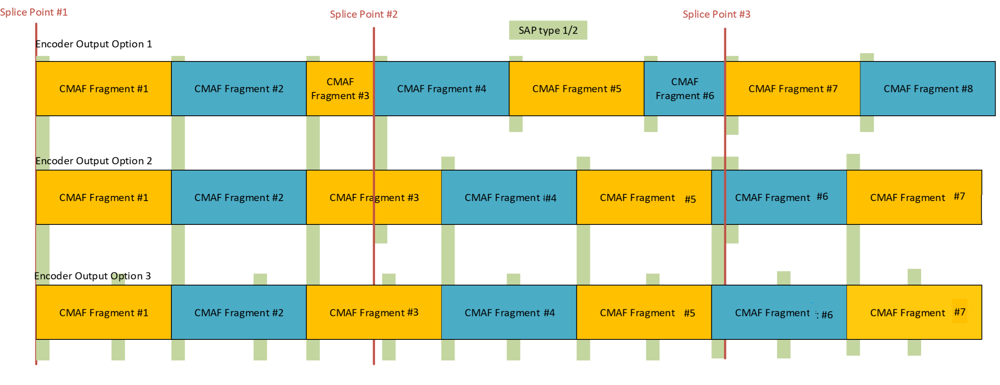

# Specification: Live Media Ingest # {#ingestspec}

## Abstract ## {#abstract}

Two closely related protocol interfaces are defined: CMAF Ingest (Interface-1)
based on fragmented MP4 and DASH/HLS Ingest (Interface-2) based on DASH and HLS.
Both interfaces use the HTTP POST (or PUT) method to transmit media objects from
an ingest source to a receiving entity. These interfaces support carriage of
audiovisual media, timed metadata and timed text. Examples of workflows using
these interfaces are provided. In addition, guidelines for synchronization of
multiple ingest sources, redundancy and failover are presented.

## Copyright Notice and Disclaimer ## {#copyrights}

Review these documents carefully as they describe your rights and restrictions
with respect to this document. Code Components extracted from this document must
include Simplified BSD License text as described in Section 4.e of the Trust
Legal Provisions and are provided without warranty as described in the
Simplified BSD License.  

This is a document made available by DASH-IF. The technology embodied in this
document may involve the use of intellectual property rights, including patents
and patent applications owned or controlled by any of the authors or developers
of this document. No patent license, either implied or express, is granted to
you by this document. DASH-IF has made no search or investigation for such
rights and DASH-IF disclaims any duty to do so. The rights and obligations which
apply to DASH-IF documents, as such rights and obligations are set forth and
defined in the DASH-IF Bylaws and IPR Policy including, but not limited to,
patent and other intellectual property license rights and obligations. A copy of
the DASH-IF Bylaws and IPR Policy can be obtained at http://dashif.org/.

The material contained herein is provided on an AS IS basis. The authors and
developers of this material and DASH-IF hereby disclaim all other warranties and
conditions, either express, implied or statutory, including, but not limited to,
any (if any) implied warranties, duties or conditions of merchantability, of
fitness for a particular purpose, of accuracy or completeness of responses, of
workmanlike effort, and of lack of negligence. In addition, this document may
include references to documents and/or technologies controlled by third parties.
Those third party documents and technologies may be subject to third party rules
and licensing terms. No intellectual property license, either implied or
express, to any third party material is granted to you by this document or
DASH-IF. DASH-IF makes no warranty whatsoever for such third party material.

# Introduction # {#introduction}

The main goal of this specification is to define the interoperability points
between an [=ingest source=] and a [=receiving entity=] that typically reside in
the cloud. While this specification does not impose any new constraints or
requirements to clients that consume media streams using any defined streaming
protocol, the preferred streaming protocol is DASH.

Live media ingest happens between an [=ingest source=] such as a
[=live encoder=] and a [=receiving entity=]. The [=receiving entity=] could be a
media packager, streaming origin or a content delivery network (CDN). The
combination of ingest sources and receiving entities is common in practical
video streaming deployments, where media processing functionality is distributed
between the ingest sources and receiving entities. Nevertheless, in such
deployments, interoperability between ingest sources and downstream processing
entities can sometimes be challenging. This challenge comes from the fact that
there are multiple levels of interoperability to be considered and vendors may
have a different view of what is expected/preferred as well as how various
technical specifications apply. First of all, the choice for the data
transmission protocol, and connection establishing and tearing down are
important. Handling premature/unexpected disconnects and recovering from
failovers are also critical.

A second level of interoperability lies with the media container and coded media
formats. MPEG defined several media container formats such as [[!ISOBMFF]] and
[[!MPEG2TS]], which are widely adopted and well supported. However, these are
general purpose formats, targeting several different application areas. To do
so, they provide many different profiles and options. Detailed interoperability
is often achieved through other application standards such as those for
broadcast, storage or streaming. For interoperable live media ingest, this
document provides guidance on how to use [[!ISOBMFF]] and [[!MPEGCMAF]] for
formatting the media content. In addition, the codec and codec profile used are
important interoperability points that themselves also have different profiles
and different configurations.

A third level of interoperability lies in the way metadata is inserted in
streams. Live content often needs such metadata to signal opportunities for ad
insertion, program information or other attributes like timed graphics or
general information relating to the broadcast. Examples of such metadata formats
include [[!SCTE35]] markers, which are often found in broadcast streams and
other metadata such as ID3 tags [[!ID3v2]] containing information relating to
the media presentation. In fact, many more types of metadata relating to the
live event might be ingested and passed on to an over-the-top (OTT) streaming  
workflow.

Fourth, for live media, handling the timeline of the presentation consistently
is important. This includes sampling of the media, avoiding timeline
discontinuities and synchronizing timestamps attached by different ingest
sources such as audio and video. In addition, media timeline discontinuities
must be avoided as much as possible during normal operation. Further, when using
redundant ingest sources, the ingested streams must be synchronized in a sample
accurate manner. Streams may also need to be started at the same time so as to
avoid misalignment between audio and video tracks.

Fifth, in practice multiple ingest sources and receiving entities are often
used. This requires that multiple ingest sources and receiving entities work
together in a redundant workflow to avoid interruptions when some of the
components fail. Well defined failover behavior is important for
interoperability.

This document provides a specification for establishing these interoperability
points. The approaches are based on known standardized technologies that have
been tested and deployed in several large-scale streaming deployments.

To address these interoperability points, two key interfaces and their protocol
specifications have been identified. The first interface (CMAF Ingest) mainly
functions as an ingest format to a packager or active media processor, while the
second interface (DASH/HLS Ingest) works mainly to ingest media presentations to
an origin server, cloud storage or CDN. Smart implementations could implement
both interfaces as one unified interface as illustrated in the examples, but
separate interfaces were defined as to reduce overhead for those who need only
one of the interfaces.

[[#workflows]] provides more background and motivation for the two interfaces.
We further motivate the specification in this document supporting HTTP/1.1
[[!RFC7230]] and [[!ISOBMFF]]. We believe that Smooth Streaming [[=MS-SSTR=]]
and HLS have shown that HTTP usage can survive the Internet ecosystem for media
delivery. The HTTP POST provides a push-based method for delivering the live
content when it becomes available. Regarding the transport protocol, in future
versions, alternative transport protocols could be considered advancing over
HTTP/1.1 or TCP. We believe the proposed media format and protocol interfaces
will provide the same benefits with other transport protocols. Our view is that
for current and near future deployments, using [[!RFC7230]] is still a good
approach.

The document is structured as follows: Section 3 presents the conventions and
terminology used throughout this document. Section 4 presents the use cases and
workflows related to media ingest and the two interfaces. Section 5 lists the
common requirements for both interfaces. Sections 6 and 7 detail Interface-1 and
Interface-2, respectively. Section 8 provides examples.

# Conventions and Terminology # {#conventions}

   The key words "MUST", "MUST NOT", "REQUIRED", "SHALL", "SHALL NOT", "SHOULD",
   "SHOULD NOT", "RECOMMENDED", "MAY", and "OPTIONAL" in this document are to be
   interpreted as described in BCP 14, RFC 2119 [[RFC2119]].

   The following terminology is used in the rest of this document:

   <dfn dfn>**ABR**</dfn>: Adaptive bitrate.

   <dfn dfn>**CMAF chunk**</dfn>: [=CMAF media object=] defined in
   [[!MPEGCMAF]] clause 7.3.2.3.

   <dfn dfn>**CMAF fragment**</dfn>: [=CMAF media object=] defined in
   [[!MPEGCMAF]] clause 7.3.2.4.

   <dfn dfn>**CMAF header**</dfn>: Defined in [[!MPEGCMAF]] clause 7.3.2.1.

   <dfn dfn>**CMAF Ingest**</dfn>: Ingest interface defined in this
   specification for push-based [[!MPEGCMAF]].

   <dfn dfn>**CMAF media object**</dfn>: Defined in [[!MPEGCMAF]]: a CMAF chunk,
   segment, fragment or track.

   <dfn dfn>**CMAF presentation**</dfn>: Logical grouping of CMAF tracks
   corresponding to a media presentation as defined in [[!MPEGCMAF]] clause 6.

   <dfn dfn>**CMAFstream**</dfn>: Byte-stream that follows the CMAF track format
   structure format defined in [[!MPEGCMAF]] between the ingest source and
   receiving entity. Due to error control behavior such as retransmission of
   CMAF fragments and headers, a CMAFstream may not fully conform to a CMAF
   track file. The receiving entity can filter out retransmitted fragments and
   headers and restore a valid CMAF track file from the CMAFstream.

   <dfn dfn>**CMAF track**</dfn>: [=CMAF media object=] defined in
   [[!MPEGCMAF]] clause 7.3.2.2.

   <dfn dfn>**connection**</dfn>: A connection setup between two hosts,
   typically the media [=ingest source=] and [=receiving entity=].

   <dfn dfn>**DASH Ingest**</dfn>: Ingest interface defined in this
   specification for push-based DASH.

   <dfn dfn>**HLS Ingest**</dfn>: Ingest interface defined in this specification
   for push-based HLS.

   <dfn dfn>**HTTP POST**</dfn>: HTTP command for sending data from a source to
   a destination.

   <dfn dfn>**ingest source**</dfn>: A media source ingesting live media content
   to a receiving entity. It is typically a [=live encoder=] but not restricted  
   to this, e.g., it could be a stored media resource.

   <dfn dfn>**ingest stream**</dfn>: The stream of media pushed from the ingest
   source to the receiving entity.

   <dfn dfn>**live stream session**</dfn>: The entire live stream for the ingest
   relating to a broadcast event.

   <dfn dfn>**live encoder**</dfn>: Entity performing live encoding of a high
   quality ingest stream. This can serve as an [=ingest source=].

   <dfn dfn>**manifest objects**</dfn>: Objects ingested that represent
   streaming manifest, e.g., .mpd in DASH and .m3u8 in HLS.

   <dfn dfn>**media objects**</dfn>: Objects ingested that represent the media,
   timed text or other non-manifest objects. Typically, these are CMAF
   addressable media objects such as CMAF chunks, segments or tracks.

   <dfn dfn>**media fragment**</dfn>: Media fragment, combination of
   MovieFragmentBox ("moof") and MediaDataBox ("mdat") in ISOBMFF structure.
   This could be a CMAF fragment or chunk. A media fragment may include
   top-level boxes defined in CMAF fragments such as "emsg", "prft" and "styp".
   Used for backward compatibility with fragmented MP4.

   <dfn dfn>**objects**</dfn>: [=Manifest objects=] or [=media objects=].

   <dfn dfn>**OTT**</dfn>: Over-the-top.  

   <dfn dfn>**POST_URL**</dfn>: Target URL of a POST command in the HTTP
   protocol for posting data from a source to a destination (e.g., /ingest1).
   The POST_URL is known by both the ingest source and receiving entity. The
   POST_URL is setup by the receiving entity. The ingest source may add extended
   paths to signal track names, fragment names or segment names.

   <dfn dfn>**publishing_point_URL**</dfn>: Entry point used to receive an
   [=ingest stream=] (e.g., https://example.com/ingest1).

   <dfn dfn>**receiving entity**</dfn>: Entity used to receive the media
   content, receives/consumes an [=ingest stream=].

   <dfn dfn>**RTP**</dfn>: Real-time Transport Protocol as specified in
   [[!RFC3550]].

   <dfn dfn>**streaming presentation**</dfn>: Set of [=objects=] composing a
   streaming presentation based on a streaming protocol such as DASH.

   <dfn dfn>**switching set**</dfn>: Group of tracks corresponding to a
   switching set defined in [[!MPEGCMAF]] or an adaptation set defined in
   [[!MPEGDASH]].

   <dfn dfn>**switching set ID**</dfn>: Identifier generated by a live ingest
   source to group CMAF tracks in a switching set. The switching set ID is
   unique for each switching set in a live stream session.

   <dfn dfn>**TCP**</dfn>: Transmission Control Protocol (TCP) as specified in  
   [[!RFC793]].

   <dfn dfn>**baseMediaDecodeTime**</dfn>: Decode time of the first sample as
   signaled in the "[=tfdt=]" box.

   <dfn dfn>**elng**</dfn>: The ExtendedLanguageTag box ("elng") as defined in
   [[!ISOBMFF]] overrides the language information.

   <dfn dfn>**ftyp**</dfn>: The FileTypeBox ("ftyp") as defined in
   [[!ISOBMFF]].

   <dfn dfn> **mdat**</dfn>: The MediaDataBox ("mdat") defined in [[!ISOBMFF]].

   <dfn dfn>**mdhd**</dfn>: The MediaHeaderBox ("mdhd") as defined in
   [[!ISOBMFF]] contains information about the media such  
   as timescale, duration, language using ISO 639-2/T [[!iso-639-2]] codes.

   <dfn dfn>**mfra (deprecated)**</dfn>: The MovieFragmentRandomAccessBox
   ("mfra") defined in [[!ISOBMFF]] signals random access samples  
   (these are samples that require no prior or other samples for decoding).  
 
   <dfn dfn>**moof**</dfn>: The MovieFragmentBox ("moof") as defined in
   [[!ISOBMFF]] defines the index information of samples in a fragment.

   <dfn dfn>**nmhd**</dfn>: The NullMediaHeaderBox ("nmhd") as defined in
   [[!ISOBMFF]] signals a track for which no specific media header is defined.
   This is used for metadata tracks.

   <dfn dfn>**prft**</dfn>: The ProducerReferenceTime ("prft") as defined in
   [[!ISOBMFF]] supplies times corresponding to the production of associated
   movie fragments.

   <dfn dfn>**tfdt**</dfn>: The TrackFragmentBaseMediaDecodeTimeBox ("tfdt")  
   defined in [[!ISOBMFF]] signals the decode time of the media  
   fragment signaled in the "moof" box.

# Media Ingest Workflows and Interfaces (Informative) # {#workflows}

Two workflows have been identified mapping to two protocol interfaces. The first
workflow uses a [=live encoder=] as the [=ingest source=] and a separate
packager as the [=receiving entity=]. In this case, Interface-1
([=CMAF Ingest=]) is used to ingest a live encoded stream to the packager, which
can perform packaging, encryption or other active media processing. Interface-1
is defined in a way that it will be possible to generate DASH or HLS
presentations based on information in the ingested stream. Figure 1 shows an
example for Interface-1.

   Figure 1: Example with [=CMAF Ingest=]. <figure>
    </figure>

The second workflow constitutes ingest to a passive delivery system such as a
cloud storage or a CDN. In this case, Interface-2 ([=DASH Ingest=] or
[=HLS Ingest=]) is used to ingest a stream already formatted to be ready for
delivery to an end client. Figure 2 shows an example for Interface-2.

   Figure 2: Example with [=DASH Ingest=].
   <figure>  </figure>

A legacy example of a media ingest protocol for the first workflow is the ingest
part of the Microsoft Smooth Streaming protocol [[=MS-SSTR=]]. This protocol
connects [=live encoder=]s/[=ingest source=]s to the Microsoft Smooth Streaming
server and to the Microsoft Azure cloud. This protocol has shown to be robust,
flexible and easy to implement in [=live encoder=]s. In addition, it provided
features for high availability and server-side redundancy.

Interface-1 ([=CMAF Ingest=], detailed in [[#interface-1]]) improves the Smooth
Streaming's ingest protocol including lessons learned over the last ten years
after the initial deployment of Smooth Streaming in 2009 and several advances on
signaling metadata and timed text. In addition, the current specification
incorporates the latest media formats and protocols, making it ready for current
and next-generation media codecs such as [[!MPEGHEVC]] and protocols like DASH
[[!MPEGDASH]].

Interface-2 (DASH/HLS Ingest) is included for ingest of media streaming
presentations to a passive receiving entity that provides a pass-through
functionality. In this case, [=manifest objects=] and other client-specific
information also need to be ingested. In Interface-2, naming and content type
identification via MIME types is important to enable direct processing and
storage of the presentation. Interface-2 could also be used as an output format
of a packager.

A key idea of this part of the specification is to re-use the similarities of
the DASH and HLS protocols to enable a simultaneous ingest of media
presentations of these two formats using common media fragments based on
[[!ISOBMFF]] and [[!MPEGCMAF]].

The two interfaces are presented separately. This reduces the overhead of the
information that needs to be signaled compared to having both interfaces
combined into one, as was the case in a draft version of this document.
Nevertheless, some instantiations, may still consider combining the two
interfaces. An example of this is given at the end of the document in
[[#examples]].

Table 1 highlights some of the key differences and practical considerations of
the interfaces. In Interface-1, the ingest source can be simple since the
[=receiving entity=] can do many of the operations related to the delivery such
as encryption or generating the streaming manifests. In addition, the
distribution of functionalities can make it easier to scale a deployment with
concurrent (redundant) live media sources and receiving entities. Besides these
factors, choosing a workflow for a video streaming platform depends on many
other factors.

   Table 1: Different ingest use cases.
   <!-- class=def is a built-in style. It is optional but looks nice. -->
   <table class="def">
   <tr>
      <th>Interface</th>
      <th>Ingest source</th>
      <th>Receiving entity</th>
   </tr>
   <tr>
      <td>CMAF Ingest</td>
      <td>Limited overview, simpler encoder, multiple sources </td>
      <td>Re-encryption, transcoding, stitching, watermarking, packaging</td>
   </tr>
   <tr>
      <td>DASH/HLS Ingest</td>
      <td>Global overview, targets duplicate presentations, limited flexibility, no redundancy</td>
      <td>Manifest manipulation, transmission, storage</td>
   </tr>
   </table>

   Figure 3: Workflow with redundant ingest sources and receiving entities.
   <figure>  </figure>

Finally, Figure 3 highlights another aspect that was taken into consideration
for large-scale systems with many users. Often content owners would like to run
multiple ingest sources, multiple receiving entities and make them available to
the clients in a seamless fashion. This approach is already common when serving
web pages, and this architecture also applies to media streaming over HTTP. In
Figure 3, it is highlighted how one or more ingest sources can be sending data
to one or more receiving entities. In such a workflow, it is important to handle
the case when one ingest source or receiving entity fails. Both the system and
client behavior are an important consideration in systems that need to run 24/7.
Failovers must be handled robustly and without causing service interruption.
This specification details how this failover and redundancy support can be
achieved.

# Common Requirements for Interface-1 and Interface-2 # {#interface-1-2}

The media ingest follows the following common requirements for both interfaces.

## Ingest Source Identification ## {#interface-1-2-user-agent}

   - The [=ingest source=] SHOULD include a User-Agent header (which provides
     information about brand name, version number and build number in a readable
     format) in all allowed HTTP messages. The receiving entity can log the
     received information along with other relevant HTTP header data to facilitate
     troubleshooting.

## General Requirements ## {#interface-1-2-general}

   1. The [=ingest source=] SHALL communicate using the HTTP POST command as
      defined in the HTTP protocol, version 1.1 [[!RFC7230]].

      NOTE: This specification does not imply any functional differentiation
      between a POST and PUT command. Either may be used to transfer content to the
      [=receiving entity=]. Unless indicated otherwise, the use of the term POST
      can be interpreted as POST or PUT.

   2. The [=ingest source=] SHOULD use HTTP over TLS, if TLS is used it SHALL
      support at least TLS version 1.2, a higher version may also be supported
      additionally [[!RFC2818]].
   3. The [=ingest source=] SHOULD us a domain name system for resolving hostnames
      to IP addresses such as DNS [[!RFC1035]] or any other system that is in
      place. If this is not the case, the domain name<->IP address mapping(s) MUST
      be known and static.
   4. In the case of 3, [=ingest source=] MUST update the IP to hostname resolution
      respecting the TTL (time-to-live) from DNS query responses. This enables
      better resilience to IP address changes in large-scale deployments where the
      IP address of the media processing entities may change frequently.
   5. In case HTTP over TLS [[!RFC2818]] is used, at least one of the basic
      authentication HTTP AUTH [[!RFC7617]], TLS client certificates or HTTP Digest
      authentication [[!RFC7616]] MUST be supported.
   6. Mutual authentication SHALL be supported. TLS client certificates SHALL chain
      to a trusted CA or be self-signed. Self-signed certificates MAY be used, for
      example, when the ingest source and receiving entity fall under the same
      administration.
   7. As compatibility profile for the TLS encryption, the [=ingest source=] SHOULD
      support the Mozilla's intermediate compatibility profile [[=Mozilla-TLS=]].
   8. In case of an authentication error confirmed by an HTTP 403 response, the
      ingest source SHALL retry to establish the [=connection=] within a fixed time
      period with updated authentication credentials. When that also results in
      error, the [=ingest source=] can retry N times, after which the
      [=ingest source=] SHOULD stop and log an error. The number of retries N can
      be configurable in the [=ingest source=].
   9. The [=ingest source=] SHOULD terminate the [=HTTP POST=] request if data is
      not being sent at a rate commensurate with the MP4 fragment duration. An HTTP
      POST command that does not send data can prevent the [=receiving entity=]
      from quickly disconnecting from the [=ingest source=] in the event of a
      service update.
   10. The HTTP POST for sparse data SHOULD be short-lived, terminating as soon as
       the data of a fragment is sent.
   11. The HTTP POST command uses the [=publishing_point_URL=] at the
       [=receiving entity=] and SHOULD use an additional relative path when posting
       different streams and fragments, for example, to signal the stream or
       fragment name.
   12. Both the [=ingest source=] and [=receiving entity=] MUST support IPv4 and
       IPv6 transport.
   13. The [=ingest source=] and [=receiving entity=] SHOULD support gzip based
       content encoding.

ISSUE: Encoder vendors are particularly requested to comment on what the
receiving entity should return, if anything, in the response body (or header)
upon the completion of the POST request. Examples may include size/name/URL of
the object posted. Discuss at
https://github.com/Dash-Industry-Forum/Ingest/issues/146.

## Failure Behaviors ## {#interface-1-2-failure}

   1. The [=ingest source=] SHOULD use a timeout in the order of a segment duration
      (e.g., 1-6 seconds) for establishing the TCP connection. If an attempt to
      establish the connection takes longer than the timeout, the ingest source
      aborts the operation and tries again.
   2. The [=ingest source=] SHOULD resend the [=objects=] for which a connection
      was terminated early or when an HTTP 400 or 403 error response was received
      if the connection was down for less than three average segments durations.
      For connections that were down longer, the [=ingest source=] can resume
      sending [=objects=] at the live edge of the media presentation.
   3. After a TCP error, the [=ingest source=] performs the following:

      3a. The current connection MUST be closed and a new connection MUST be
      created for a new HTTP POST command.

      3b. The new HTTP [=POST_URL=] MUST be the same as the initial [=POST_URL=]
      for the object to be ingested.

   4. In case the [=receiving entity=] cannot process the POST request due to
      authentication or permission problems, or incorrect path, it SHALL return an
      HTTP 403 Forbidden error.
   5. The following error conditions apply to the receiving entity:

      5a. If the [=publishing_point_URL=] receiving the HTTP POST command is not
      available, it SHOULD return an HTTP 404 Not Found error to the
      [=ingest source=].

      5b. If the receiving entity can process a fragment in the POST request body
      but finds the media type is not supported, it may return an HTTP 415
      Unsupported Media Type error.

      5c. If the receiving entity cannot process a fragment in the POST request
      body due to missing or incorrect initialization fragment, it may return an
      HTTP 412 Precondition Failed error.

      5d. If there is an error at the receiving entity not particularly relating to
      the POST command from the [=ingest source=], it may return an appropriate
      HTTP 5xx error.

      5e. In all other scenarios, the receiving entity MUST return an HTTP 400 Bad
      Request error.

   6. The [=ingest source=] SHOULD support the handling of HTTP 30x redirect
      responses from the receiving entity.

# Interface-1: CMAF Ingest # {#interface-1}

This section describes the protocol behavior specific to Interface-1. Operation
of this interface MUST also adhere to the common requirements given in
[[#interface-1-2]].

## General Considerations (Informative) ## {#interface-1-general}

The media format is based on CMAF, conforming to the track constraints specified
in [[!MPEGCMAF]] clause 7. A key benefit of this format is that it allows easy
identification of stream boundaries, enabling switching, redundancy,
retransmission resulting in a good fit with current Internet infrastructures. We
believe that the CMAF track format will make things easier and that the industry
is already heading in this direction following recent specifications  
like [[!MPEGCMAF]] and HLS [[!RFC8216]]. Note that no CMAF media profile is
needed by this specification unless stated otherwise; only the structural format
based on [[!MPEGCMAF]] clause 7 is used.

[=CMAF Ingest=] assumes ingest to an active receiving entity, such as a packager
or active origin server. However, it can also be used for simple transport of
media to an archive, as the combination of CMAF header and CMAF fragments will
result in a valid archived CMAF track file when an ingest is stored on disk by
the receiving entity.

[=CMAF Ingest=] advances over the ingest part of the Smooth Streaming's ingest
protocol [[=MS-SSTR=]] by only using standardized media container formats and
boxes based on [[!ISOBMFF]] and [[!MPEGCMAF]].

Many new technologies like MPEG HEVC, AV1, HDR have CMAF bindings. Using CMAF
will make it easier to adopt such technologies. This project started as a
multi-vendor interop project, some discussions on the early development of the
specification have been documented in [[=fmp4git=]].

   Figure 4: CMAF Ingest with multiple ingest sources.
   <figure>  </figure>

Figures 5-7 detail some of the concepts and structures defined in
[[!MPEGCMAF]]. Figure 5 shows the data format structure of the [=CMAF track=].
In this format, media samples and media indexes are interleaved. The
MovieFragmentBox "[=moof=]" box as specified in [[!ISOBMFF]] is used to signal
the information to playback and decode properties of the samples stored in the
"[=mdat=]" box. The CMAF header contains the track specific information and is
referred to as a [=CMAF header=] in [[!MPEGCMAF]]. The combination of
"[=moof=]" and "[=mdat=]" can be referred as a [=CMAF fragment=] or
[=CMAF chunk=] depending on the structure content and the number of moof-mdat
pairs in the addressable object.

   Figure 5: CMAF track stream.
   <figure> </figure>

Figure 6 illustrates the presentation timing model, defined in [[!MPEGCMAF]]
clause 6.6. Different bitrate tracks and/or media streams are conveyed in
separate CMAF tracks. By having fragment boundaries time aligned for tracks and
applying constraints on tracks, seamless switching can be achieved. By using a
common timeline different streams can be synchronized at the receiver, while
they are in a separate [=CMAF track=], sent over a separate connection, possibly
from a different [=ingest source=].

For more information on the synchronization model, we refer the readers to
Section 6 of [[!MPEGCMAF]]. For synchronization of tracks coming from different
encoders, sample-time accuracy is required, i.e., the samples with identical
timestamp contain identical content.

In Figure 7, another advantage of this synchronization model is illustrated,
which is the concept of late binding. In the case of late binding, streams are
combined on playout/streaming in a presentation (see Section 7.3.6 of
[[!MPEGCMAF]]).

NOTE: As defined in [[!MPEGCMAF]], different CMAF tracks have the same starting
time sharing an implicit timeline. A stream becoming available from a different
source needs to be synchronized and time-aligned with other streams.

   Figure 6: CMAF track synchronization.
   <figure> </figure>

   Figure 7: CMAF late binding.
   <figure> </figure>

Figure 8 shows the flow diagram of the protocol. It starts with a DNS resolution
(if needed) and an authentication step (using two factor authentication, TLS certificates or HTTP
Digest Authentication) to establish a secure [=TCP=] connection.

In private datacenter deployments where nodes are not reachable from outside, a
non-authenticated connection may also be used. The ingest source then issues an
HTTP POST command to test that the [=receiving entity=] is listening. This POST
may send the [=CMAF header=] or could be empty. In case the test is successful,
it is followed by the CMAF header and fragments composing the [=CMAFstream=]. At
the end of the session, the source may send an empty [=mfra (deprecated)=] box
or a segment with the *lmsg* brand to conclude the POST command. Then, the
[=ingest source=] can follow up by closing the TCP connection using a TCP FIN
packet.

NOTE: If the HTTP POST is using the chunked transfer encoding option, the
[=ingest source=] sends a zero-length terminating chunk per [[!RFC7230]] after
sending the *lmsg* brand letting the [=receiving entity=] know that the POST
command has been concluded.

   Figure 8: CMAF Ingest flow.
   <figure> </figure>

## General Protocol and Track Format Requirements ## {#interface-1-requirements}

The ingest source transmits media content to the receiving entity using HTTP
POST. The receiving entity listens for content at the [=publishing_point_URL=]
that is known by both the ingest source and receiving entity. The [=POST_URL=]
may contain an extended path to identify the stream name, switching set or
fragment may be added by the ingest source. It is assumed that the ingest source
can retrieve these paths and use them.

In Interface-1, the container format is based on CMAF, conforming to the track
constraints specified in [[!MPEGCMAF]] clause 7. Unless stated otherwise, no
conformance to a specific CMAF media profile is REQUIRED.

   1. The ingest source SHALL start by an HTTP POST request with the CMAF header,
      or an empty request, to the POST_URL. This can help the ingest source quickly
      detect whether the [=publishing_point_URL=] is valid, and if there are any
      authentication or other conditions required.
   2. The ingest source MUST initiate a media ingest connection by posting at least
      one CMAF header after step 1. Then, it SHOULD post a DASH manifest following
      clause 16 of this section unless the grouping of the CMAF tracks is trivial.
   3. The ingest source SHALL transmit one or more CMAF segments composing the
      track to the receiving entity once they become available. In this case, a
      single POST request message body MUST contain one CMAF segment in the body of
      that request. 
   4. The ingest source MAY use the chunked transfer encoding option of the HTTP
      POST command [[!RFC7230]] when the content length is unknown at the start of
      transmission or to support use cases that require low latency.
   5. If the HTTP POST request terminates or times out with a TCP error, the ingest
      source MUST establish a new connection and follow the preceding requirements.
      Additionally, the ingest source MAY resend the segment in which the timeout
      or TCP error occurred.
   6. The ingest source MUST handle any error responses received from the receiving
      entity, as described in general requirements, and by retransmitting the
      [=CMAF header=].
   7. *(deprecated)* In case the [=live stream session=] is over the ingest source
      MAY signal the stop by transmitting an empty [=mfra (deprecated)=] box
      towards the receiving entity. After that it SHALL send an empty HTTP chunk
      and wait for the HTTP response before closing TCP connection.
   8. The ingest source SHOULD use a separate parallel TCP connection for ingest of
      each different CMAF track.
   9. The ingest source MAY use a separate relative path in the [=POST_URL=] for
      ingesting each different track or track segment by appending it to the
      [=POST_URL=]. This makes it easy to detect redundant streams from different
      ingest sources. The Streams(stream_name) keyword may be used to signal the
      name of a stream.
   10. The [=baseMediaDecodeTime=] timestamps in "tfdt" of fragments in the
       [=CMAFstream=] SHOULD arrive in increasing order for each of the fragments
       in the different tracks/streams that are ingested.
   11. The fragment sequence numbers in the [=CMAFstream=] signaled in the
       "mfhd" box SHOULD arrive in increasing order for each of the different
       tracks/streams that are ingested. Using both [=baseMediaDecodeTime=] and
       sequence number based indexing helps the receiving entities identify
       discontinuities. In this case sequence numbers SHOULD increase by one.  
   12. The average and maximum bitrate of each track SHOULD be signaled in the
       "btrt" box in the sample entry of the CMAF header. These can be used to
       signal the bitrate later on, such as in the manifest.
   13. In case a track is part of a [=switching set=], all properties in Sections
       6.4 and 7.3.4 of [[!MPEGCMAF]] MUST be satisfied, enabling the receiver to
       group the tracks in the respective switching sets.
   14. Ingested tracks MUST conform to CMAF track structure defined in
       [[!MPEGCMAF]]. Additional constraints on the CMAF track structure are
       defined in later sections.
   15. CMAF tracks MAY use SegmentTypeBox to signal brands like chunk, fragment or
       segment. Such signaling may also be inserted in a later stage by the
       receiving entity. A smart receiving entity can detect what type of media
       object is received from the information in the MovieFragmentBox.
   16. The DASH manifest should use SegmentTemplate with SegmentTimeline,
       preferably with $Time$ based naming that can be automatically extended. Only
       relative BaseURL is used. In addition, the period availability start time
       should be set to 1-1-1970 (Unix epoch) and the period start to 0.
   17. In case the ingest source loses its own input or input is absent, it SHALL
       insert filler or replacement content, and output these as valid CMAF
       segments. Examples may be black frames, silent audio, or empty timed text
       segments. Such segments SHOULD be labelled by using a SegmentTypeBox
       ("styp") with the *slat* brand. This allows a receiver to still replace
       those segments with valid content segments at a later time.
   18. The last segment in a CMAF track, SHOULD be labelled with a SegmentTypeBox
       ("styp") with the *lmsg* brand. This way, the receiver knows that no more
       media segments are expected for this track. In case the track is restarted,
       a request with a [=CMAF header=] with (identical properties) must be issued
       to the same [=POST_URL=].
   19. CMAF segments may include one or more DASHEventMessageBox'es ("emsg")
       containing timed metadata.

       NOTE: According to [[!MPEGDASH]], all DASHEventMessageBox'es ("emsg") must
       have a presentation_time later as compared to the segment's earliest
       presentation time. This can make re-signaling of continuation events (events
       that are still active) troublesome.

       NOTE: Including DASHEventMessageBox'es ("emsg") boxes in media segments may
       result in a loss of performance for just-in-time packaging. In this case,
       timed metadata [[#interface-1-timed-metadata]] should be considered.

   20. CMAF media (audio and video) tracks SHALL include the
       ProducerReferenceTimeBox'es ("[=prft=]") in the ingest. In these media
       tracks, all segments SHALL include a "[=prft=]" box. The "[=prft=]" box
       permits the end client to compute the end-to-end latency or the encoding
       plus distribution latency.

       ISSUE: Encoder vendors are particularly requested to review clause 20.

   21. In case the input to the ingest source is MPEG-2 TS based, the ingest source
       is responsible for converting the presentation timestamps and program clock
       reference (PCR) to a timeline suitable for [[!MPEGDASH]] and [[!ISOBMFF]]
       with the correct anchor and timescales. The RECOMMENDED timescales and
       anchors are provided in next sections for each track type. For dual-encoder
       synchronization, it is also RECOMMENDED to use the Unix epoch or another
       well-known anchor point to map the DASH presentation.

In case a receiving entity cannot process a request from an ingest source
correctly, it can send an HTTP error code. See [[#interface-1-failover]] or
[[#interface-1-2]] for details.

## Requirements for Formatting Media Tracks ## {#interface-1-media-tracks}

[[!MPEGCMAF]] has the notion of [=CMAF track=], which are composed of
[=CMAF fragment=] and [=CMAF chunk=]s. A fragment can be composed of one or more
chunks. The [=media fragment=] defined in ISOBMFF predates the definition in
CMAF. It is assumed that the ingest source uses HTTP POST to transmit a CMAF
fragments to the receiving entity. The following are additional requirements
imposed to the formatting of CMAF media tracks.

   1. Media tracks SHALL be formatted using boxes according to Section 7 of
      [[!MPEGCMAF]]. Media track SHOULD not use media-level encryption (e.g.,
      common encryption), as HTTP over TLS (HTTPS) should provide sufficient
      transport layer security. However, in case common encryption is used, the
      decryption key shall be made available out of band by supported means such as
      CPIX defined by DASH-IF.
   2. The [=CMAF fragment=] durations SHOULD be constant; the duration MAY
      fluctuate to compensate for non-integer frame rates. By choosing an
      appropriate timescale (a multiple of the frame rate is recommended) this
      issue should be avoided.
   3. The [=CMAF fragment=] durations SHOULD be between approximately one and six
      seconds.
   4. Media tracks SHOULD use a timescale for video streams based on the framerate
      and 44.1 KHz or 48 KHz for audio streams or any another timescale that
      enables integer increments of the decode times of fragments signaled in the
      "tfdt" box based on this scale. If necessary, integer multiples of these
      timescales could be used.
   5. The language of the CMAF track SHOULD be signaled in the "[=mdhd=]" box or
      "[=elng=]" boxes in the CMAF header.
   6. Media tracks SHOULD contain the ("btrt") box specifying the target average
      and maximum bitrate of the CMAF fragments in the sample entry container in
      the CMAF header.
   7. Media tracks MAY be composed of CMAF chunks [[!MPEGCMAF]] clause 7.3.2.3. In
      this case, they SHOULD be signaled using SegmentTypeBox ("styp") to make it
      easy for the receiving entity to differentiate them from CMAF fragments. The
      brand type of a chunk is *cmfl*. CMAF chunks should only be signaled if they
      are not the first chunk in a CMAF fragment.
   8. In video tracks, profiles like avc1 and hvc1 MAY be used that signal the
      sequence parameter set in the CMAF header. In this case, these codec
      parameters do not change dynamically during the live session in the media
      track.
   9. However, video tracks SHOULD use profiles like avc3 or hev1 that signal the
      parameter sets (PPS, SPS, VPS) in in the media samples. This allows inband
      signaling of parameter changes. This is because in live content, codec
      configuration may change slightly over time.
   10. In case the language of a track changes, a new CMAF header with updated
       "[=mdhd=]" and/or "[=elng=]" SHOULD be sent. The CMAF header MUST be
       identical, except the "elng" tag.
   11. Track roles SHOULD be signaled in the ingest by using a "kind" box in
       UserDataBox ("udta"). The "kind" box MUST contain a schemeIdUri
       urn:mpeg:dash:role:2011 and a value containing a Role as defined in
       [[!MPEGDASH]]. In case this signaling does not occur, the processing entity
       can define the role for the track independently.

## Requirements for Signaling Switching Sets ## {#interface-1-switchingsets}

In live streaming, a [=CMAF presentation=] of streams corresponding to a channel
is ingested by posting to a [=publishing_point_URL=] at the receiving entity.
CMAF has the notion of switching sets [[!MPEGCMAF]] that map to similar
streaming protocol concepts like adaptation set in DASH. To signal a switching
set in a CMAF presentation, CMAF media tracks MUST correspond to the constraints
defined in [[!MPEGCMAF]] clause 7.3.4.

In addition, optional explicit signaling is defined in this clause. This would
mean the following steps could be implemented by the live ingest source.
  
   1. A live ingest source MAY generate a [=switching set ID=] that is unique
      for each switching set in a live stream session. Tracks with the same
      [=switching set ID=] belong to the same switching set. The switching set
      ID can be a string or (small) integer number. Characters in
      [=switching set ID=] SHALL be unreserved, i.e., A-Za-z0-9_.-~ in order to
      avoid introducing delimiters.
   2. The [=switching set ID=] can be added in a relative path to the [=POST_URL=]
      using the Switching() keyword. In this case, a CMAF segment is sent from the
      live ingest source as POST chunk.cmfv
      POST_URL/Switching([=switching set ID=])/Streams(stream_id).

      ISSUE: Discuss clause 2 at
      https://github.com/Dash-Industry-Forum/Ingest/issues/125.

   3. The live ingest source MAY add a "kind" box in the "udta" box in each track
      to signal the switching set it belongs to. The schemeIdUri of this "kind" box
      SHALL be urn:dashif:ingest:switchingset_id and the value field of the "kind"
      box SHALL be the [=switching set ID=].
   4. The switching sets are grouped as adaptation sets present in the DASH
      manifest in a POST request issued earlier, i.e., before the segments of that
      switching set are transmitted. In this case, the naming of the segment URIs
      follows the naming defined in the DASH manifest based on a SegmentTemplate
      and SegmentTimeline elements with a relative BaseURL.
  
   Table 2: Switching set signaling options.
   <table class="def">
      <tr>
         <th>Signaling option</th>
         <th>Requirement</th>
      </tr>
      <tr>
         <td>Implicit signaling based on switching set constraints [[!MPEGCMAF]] clause 7.3.4.</td>
         <td>Mandatory</td>
      </tr>
      <tr>
         <td>Signaling using [=switching set ID=] in the [=POST_URL=] using Switching() keyword</td>
         <td>Optional</td>
      </tr>
      <tr>
         <td>Signaling using DASH AdaptationSet and defined naming structure based on SegmentTemplate and SegmentTimeline</td>
         <td>Optional</td>
      </tr>
      <tr>
         <td>Signaling using [=switching set ID=] in the track using "kind" box with schemeIdUri urn:dashif:ingest:switchingset_id and value set to [=switching set ID=]</td>
         <td>Optional</td>
      </tr>
   </table>

## Requirements for Timed Text, Captions and Subtitle Tracks ## {#interface-1-timed-text-captions}

The live media ingest specification follows requirements for ingesting a track
with timed text, captions and/or subtitle streams. The recommendations for
formatting subtitle and timed text tracks are defined in [[!MPEGCMAF]] and
[[!MPEG4-30]].

We provide additional guidelines and best practices for formatting timed text
and subtitle tracks.

   1. CMAF tracks carrying WebVTT signaled by the *cwvt* brand or TTML Text
      signaled by the *im1t* brand are preferred. [[!MPEG4-30]] defines the track
      format selected in [[!MPEGCMAF]].  
   2. Based on this [[!ISOBMFF]], the trackhandler "hdlr" SHALL be set to "text"
      for WebVTT and "subt" for TTML following [[!MPEG4-30]].
   3. The "[=ftyp=]" box in the CMAF header for the track containing timed text,
      images, captions and subtitles MAY use signaling using CMAF profiles based on
      [[!MPEGCMAF]]:

      3a. WebVTT specified in Section 11.2 of ISO/IEC 14496-30 [[!MPEG4-30]] *cwvt*

      3b. TTML IMSC1 Text specified in Section 11.3.3 of [[!MPEG4-30]] IMSC1 Text
      profile *im1t*

      3c. TTML IMSC1 Image specified in Section 11.3.4 of [[!MPEG4-30]] IMSC1 Image
      profile *im1i*

   4. The BitRateBox ("btrt") SHOULD be used to signal the average and maximum
      bitrate in the sample entry box, this is most relevant for bitmap or XML
      based timed text subtitles that may consume significant bandwidth (e.g., im1i
      or im1t).
   5. In case the language of a track changes, a new CMAF header with updated
      "[=mdhd=]" and/or "[=elng=]" SHOULD be sent from the ingest source to the
      receiving entity.
   6. Track roles can be signaled in the ingest, by using a "kind" box in the
      "udta" box. The "kind" box MUST contain a schemeIdUri urn:mpeg:dash:role:2011
      and a value containing a role as defined in [[!MPEGDASH]].

NOTE: [[!MPEGCMAF]] allows multiple "kind" boxes, hence, multiple roles can be
signaled. By default, one should signal the DASH role urn:mpeg:dash:role:2011. A
receiver may derive corresponding configuration for other streaming protocols
such as HLS. In case this is not desired, additional "kind" boxes with
corresponding schemeIdUri and values can be used to explicitly signal this
information for other protocol schemes. Subschemes can be signaled in the
schemeIdURI as schemeIdURI@value.

An informative scheme of defined roles in DASH and respective corresponding
roles in HLS can be found below, additionally the forced subtitle in HLS might
be derived from a DASH forced subtitle role as well by a [=receiving entity=].

   Table 3: Roles for subtitle and audio tracks and HLS characteristics.
   <table class="def">
      <tr>
         <th>HLS characteristic</th>
         <th>urn:mpeg:dash:role:2011</th>
      </tr>
      <tr>
         <td>transcribes-spoken-dialog</td>
         <td>subtitle</td>
      </tr>
      <tr>
         <td>easy-to-read</td>
         <td>easyreader</td>
      </tr>
      <tr>
         <td>describes-video</td>
         <td>description</td>
      </tr>
      <tr>
         <td>describes-music-and-sound</td>
         <td>caption</td>
      </tr>
   </table>

DASH roles are defined in urn:mpeg:dash:role:2011 [[!MPEGDASH]]. Another example
for explicitly signaling roles could be DVB DASH [[!DVB-DASH]]:

   

   kind.schemeIdUri="urn:tva:metadata:cs:AudioPurposeCS:2007@1"
   kind.value="Alternate"
   

## Requirements for Timed Metadata Tracks ## {#interface-1-timed-metadata}

This section discusses the specific formatting requirements for [=CMAF Ingest=]
of timed metadata. Examples of timed metadata are opportunities for splice
points and program information signaled by SCTE-35 markers. Such event signaling
is different from regular audio/video information because of its sparse nature.
In this case, the signaling data usually does not happen continuously and the
intervals may be hard to predict. Other examples of timed metadata are ID3 tags
[[!ID3v2]], SCTE-35 markers [[!SCTE35]] and DASHEventMessageBox'es defined in
Section 5.10.3.3 of [[!MPEGDASH]].

Table 4 provides some example urn schemes to be signaled. Table 5 illustrates an
example of a SCTE-35 marker stored in a DASHEventMessageBox that is in turn
stored as a metadata sample in a metadata track. The presented approach enables
ingest of timed metadata from different sources, because data is not interleaved
with the media.
  
By using CMAF timed metadata tack, the same track and presentation formatting
are applied for metadata as for other tracks ingested, and the metadata is part
of the [=CMAF presentation=].

By embedding the DASHEventMessageBox structure in timed metadata samples, some
of the benefits of its usages in DASH and CMAF are kept. In addition, it enables
signaling of gaps, overlapping events and multiple events starting at the same
time in a single timed metadata track for this scheme. In addition, the parsing
and processing of DASHEventMessageBox'es is supported in many players. The
support for this DASHEventMessageBox embedded timed metadata track instantiation
is described.
  
An example of adding an ID3 tag in a DASHEventMessageBox can be found in
[[=aomid3=]].

   Table 4: Example URN schemes for timed metadata tracks.
   <table class="def">
      <tr>
         <th>SchemeIdURI</th>
         <th>Reference</th>
      </tr>
      <tr>
         <td>urn:mpeg:dash:event:2012</td>
         <td>[[!MPEGDASH]], 5.10.4 subtitle</td>
      </tr>
      <tr>
         <td>urn:dvb:iptv:cpm:2014</td>
         <td>[[!DVB-DASH]], 9.1.2.1</td>
      </tr>
      <tr>
         <td>urn:scte:scte35:2013:bin </td>
         <td>[[!SCTE214-1]] SCTE-35  </td>
      </tr>
      <tr>
         <td>www.nielsen.com:id3:v1  </td>
         <td>Nielsen ID3 in DASH  [[!ID3v2]] </td>
      </tr>
   </table>

   Table 5: Example of a SCTE-35 marker embedded in a DASH EventMessageBox.
   <table class="def">
      <tr>
         <th>Tag</th>
         <th>Value</th>
      </tr>
      <tr>
         <td>scheme_uri_id</td>
         <td>urn:scte:scte35:2013:bin</td>
      </tr>
      <tr>
         <td>value </td>
         <td>value used to signal subscheme</td>
      </tr>
      <tr>
         <td>timescale</td>
         <td>positive number, ticks per second, similar to track timescale</td>
      </tr>
      <tr>
         <td>presentation_time_delta</td>
         <td>non-negative number</td>
      </tr>
      <tr>
         <td>event_duration</td>
         <td>duration of event "0xFFFFFFFF" if unknown</td>
      </tr>
      <tr>
         <td>id</td>
         <td>unique identifier for message</td>
      </tr>
      <tr>
         <td>message_data </td>
         <td>splice info section including CRC</td>
      </tr>
   </table>

The following are requirements and recommendations that apply to the timed
metadata ingest of information related to events, tags, ad markers and program
information and others:

   1. Metadata SHALL be conveyed in a CMAF track, where the media handler (hdlr) is
      "meta", the track handler box is a NullMediaHeaderBox ("[=nmhd=]") as defined
      for timed metadata tracks in [[!ISOBMFF]] clause 12.3.
   2. The CMAF timed metadata track applies to the [=CMAF presentation=] ingested
      to a [=publishing_point_URL=] at the receiving entity.
   3. To fulfill CMAF track requirements in [[!MPEGCMAF]] clause 7.3., such as not
      having gaps in the media timeline, filler data may be needed. Such filler
      data SHALL be defined by the metadata scheme signaled in URIMetaSampleEntry.
      For example, WebVTT tracks define a VTTEmptyCueBox in [[!MPEG4-30]] clause
      6.6. This cue is to be carried in samples in which no active cue occurs.
      Other schemes could define empty fillers amongst similar lines.
   4. CMAF track files do not support overlapping, multiple concurrently active or
      zero duration samples. In case metadata or events are concurrent, overlapping
      or of zero duration, such semantics MUST be defined by the scheme signaled in
      the URIMetaSampleEntry. The timed metadata track MUST still conform to
      [[!MPEGCMAF]] clause 7.3.
   5. CMAF timed metadata tracks MAY carry DASHEventMessageBox'es as defined in
      [[!MPEGDASH]] clause 5.9.8.3.3. in the metadata samples. The best way to
      create such a track is based on ISO/IEC 23001-18 (under development). Some
      deprecated implementations may use DASHEventMessageBox'es as defined in
      ISO/IEC 23009-1. Using DASHEventMessageBox'es directly in samples may be
      implemented as follows:

      5a. Version 1 SHOULD be used. In case version 0 is used, the
      presentation_time_delta refers to presentation time of the sample enclosing
      the DASHEventMessageBox.

      5b. The URIMetaSampleEntry SHOULD contain the URN "urn:mpeg:dash:event:2012"
      or an equivalent URN to signal the presence of DASHEventMessageBox'es.

      5c. The timescale of the DASHEventMessageBox SHOULD match the value specified
      in the MediaHeaderBox ("mdhd") of the timed metadata track.

      5d. The sample SHOULD contain all DASHEventMessageBox'es that are active in
      during the presentation time of the sample.  

      5e. A single metadata sample MAY contain multiple DASHEventMessageBox'es.
      This happens if multiple DASHEventMessageBox'es have the same presentation
      time or if an earlier event is still active in a sample containing a newly
      started and overlapping event.

      5f. The schemeIdUri in the DASHEventMessageBox can be used to signal the
      scheme of the data carried in the message data field. This enables carriage
      of multiple metadata schemes in a track.

      5g. For SCTE-35 ingest, the schemeIdURI in the DASHEventMessageBox MUST be
      "urn:scte:scte35:2013:bin" as defined in [[!SCTE214-3]]. A binary SCTE-35
      payload is carried in the message_data field of a DASHEventMessageBox. If a
      splice point is signaled, media tracks MUST insert an IDR frame at the time
      corresponding to the event presentation time.

      5h. It may be necessary to add filler samples to avoid gaps in the CMAF track
      timeline. This may be done using EventMessageEmptyBox (8 bytes) with 4cc code
      of "emeb" or "embe".

      5i. If ID3 tags are carried, the DASHEventMessageBox MUST be formatted as
      defined in [[=aomid3=]].

      5j. The value and id field of the DASHEventMessageBox can be used by the
      receiving entity to detect duplicate events.

   6. The ingest source SHOULD NOT embed inband top-level
      DASHEventMessageBox'es ("emsg") in the timed metadata track.

   7. Timed metadata tracks, similar to other CMAF tracks, SHOULD use a constant
      segment duration. As actual timed metadata durations may vary in practice,
      timed metadata schemes should support schemes for re-signaling all active
      timed metadata in each segment. This way, constant duration segments (e.g.,
      two-second segments) can still be used and metadata that is still active can
      be repeated in later segments. ISO/IEC 23001-18 (under development) has
      explicit support for this feature by repeating the event message boxes.

   8. In case the timed metadata track is also signaled in the manifest, the
      @codecs string should be set to the 4cc code of the sample entry, e.g.,
      "urim" for URIMetaSampleEntry. The contentType field should be set to
      "meta" and mimeType field to "application/mp4". Additional supplemental or
      essential property descriptors may be used to further describe the content
      of the metadata track in the manifest.

## Requirements for Signaling and Conditioning Splice Points  ## {#interface-1-splicing}

Splicing is important for use cases like ad insertion or clipping of content.
The requirements for signaling splice points and content conditioning at
respective splice points are as follows.

   1. The preferred method for signaling splice point uses the timed metadata track
      sample with a presentation time corresponding to the splice point. The timed
      metadata track sample is carrying events carrying binary SCTE-35 based on the
      scheme urn:scte:scte35:2013:bin. The command carried in the binary SCTE-35
      shall carry a splice info section with spliceInsert command with out of
      network indicator set to 1 and a break_duration matching the actual break
      duration.

   2. Information related to splicing, whether SCTE-35 based or by other means,
      whether in an EventMessageBox or timed metadata track sample or event MUST be
      available to the receiver at least four seconds before the media segment with
      the intended splice point.

   3. The splice time SHALL equal the presentation time of the metadata sample or
      event message, as the SCTE-35 timing is based on MPEG-2 TS and has no meaning
      in CMAF or DASH. The media ingest source is responsible for the frame
      accurate conversion of this time similar to for the media segments.

   4. In case a separate SCTE-35 command is used as a CUE-IN, the actual duration
      of the break SHALL match the announced break duration in the CUE-OUT in the
      initial SCTE-35 command.

   5. In case segmentation descriptors are used and multiple descriptors are
      present, a separate event message with a duration corresponding to each of
      the descriptors SHOULD be used.

   6. Sync samples shall be signaled in the corresponding media tracks according to
      the semantics of ISOBMFF, for example, using per sample flags in track run
      box if needed. In case dual-encoder synchronization is required, inserting
      IDR frames inside segments is preferable over introducing segment boundary.

The conditioning follows [[=DASH-IFad=]] shown in Figure 9:

   Figure 9: Splice point conditioning.
   <figure>  </figure>

The splice point conditioning in [[=DASH-IFad=]] are defined as follows:

   1. Option 1 (splice conditioned packaging): Both a fragment boundary and a SAP 1
      or SAP 2 (stream access point) at the splice point.
   2. Option 2 (splice conditioned encoding): A SAP 1 or SAP 2 stream access point
      at the frame at the boundary.
   3. Option 3 (splice point signaling): Specific content conditioning at the
      splice point.

This specification requires option 1 or 2 to be applied. Option 2 is required
for dual-encoder synchronization to avoid variation of the segment durations.

## Requirements for Failovers and Connection Error Handling ## {#interface-1-failover}

Given the nature of live streaming, good failover support is critical for
ensuring the availability of the service. Typically, media services are designed
to handle various types of failures, including network errors, server errors,
and storage issues. When used in conjunction with proper failover logic from the
ingest source side, highly reliable live streaming setups can be built. In this
section, we discuss requirements for failover scenarios. 

When the [=receiving entity=] fails:

   - A new instance SHOULD be created listening to the same
     [=publishing_point_URL=] for the ingest stream.

When the [=ingest source=] fails: 

   1. A new instance SHOULD be instantiated to continue the ingest for the live
      streaming session.
   2. The new instance MUST use the same URL for HTTP POST requests as the failed
      instance.
   3. The new instance's POST request MUST include the same [=CMAF header=] or CMAF
      header as the failed instance.
   4. The new instance MUST be properly synced with all other running ingest
      sources for the same live presentation to generate synced audio/video samples
      with aligned fragment boundaries in the track. This implies that UTC
      timestamps in the "tfdt" box match.
   5. The new stream MUST be semantically equivalent with the previous stream, and
      interchangeable at the header and media fragment levels.
   6. The new instance SHOULD try to minimize data loss. The
      [=baseMediaDecodeTime=] of fragments SHOULD increase from the point where the
      encoder last stopped. The [=baseMediaDecodeTime=] in the "tfdt" box SHOULD
      increase in a continuous manner, but it is permissible to introduce a
      discontinuity, if necessary. A receiving entity can ignore fragments that it
      has already received and processed, so it is better to err on the side of
      resending fragments than to introduce discontinuities in the media timeline.
   7. In some cases, an alternative source can be used by the receiving entity to
      request the missing segments through additional signaling, which is out of
      the scope of this specification.

## Requirements for Ingest Source Synchronization ## {#interface-1-dualsync}

ISSUE: Encoder vendors are particularly requested to review this section.

In the case of more than one redundant ingest sources, synchronization between
them can be achieved as follows. A fixed segment duration is chosen such as
based on the fixed GoP duration, e.g., two seconds that is used by all media
sources. So the segment duration is fixed for all tracks (not only the video
tracks). The media sources use a fixed anchor T as a timeline origin, this
should be 1-1-1970 (Unix epoch) or another well-known defined time anchor. The
segment boundaries in this case are K * segment duration (since anchor T) for an
integer K > 0. Any media source joining or starting can compute the fragment
boundary and produce segments with equivalent segment boundaries corresponding
to approximately the current time by choosing K sufficiently large.

It is assumed that media sources generate signals from a synchronized source and
can use timing information from this source, e.g., MPEG-2 TS presentation time
stamp or SDI signals to compute such timestamps for each segment. For example,
in the case of MPEG-2 TS program clock reference (PCR) and presentation
timestamps can be used. Based on this conversion, different media sources will
produce segments with identical durations, timestamps and enclosing frames. By
this conversion to a common timeline based on a common anchor (in this case the
Unix epoch) and fixed segment durations, ingest sources can join and leave the
synchronized operation, enabling both synchronization and redundancy.

In this setup, a first ingest source can be seamlessly replaced by a redundant
second ingest source. In case of splicing, it is important that the ingest
source inserts an IDR frame but not a segment or fragment boundary.

# Interface-2: DASH and HLS Ingest # {#interface-2}

Interface-2 defines the protocol specific behavior required to ingest a
[=streaming presentation=] composed of [=manifest objects=] and
[=media objects=] to receiving entities. In this mode, the ingest source
prepares and delivers to the receiving entity all the [=objects=] intended for
consumption by a client. These are a complete streaming presentation including
all manifest and media objects.

This interface is intended to be used by workflows that do not require active
media processing after encoding. It leverages the fact that many encoders
provide DASH and HLS packaging capabilities and that the resulting packaged
content can easily be transferred via HTTP to standard web servers. However,
neither DASH nor HLS has specified how such a workflow is intended to work
leaving the industry to self-specify key decisions such as how to secure and
authenticate ingest sources, who is responsible for managing the content life
cycle, the order of operations, failover features, robustness methods, etc. In
most cases, a working solution can be had using a readily available web server
such as Nginx or Varnish and the standard compliment of HTTP methods. In many
cases, Interface-2 simply documents what is considered an industry best practice
while attempting to provide guidance to areas less commonly considered.

The requirements below (in addition to the common requirements listed in
[[#interface-1-2]]) encapsulate all the needed functionality to support
Interface-2. In case [[!MPEGCMAF]] media is used, the media track and segment
formatting will be similar as defined in Interface-1.

## General Requirements ## {#interface-2-requirements}

### Industry Compliance ### {#interface-2-industry}

   1. The ingest source MUST be able to create a compliant streaming presentation
      for DASH and/or HLS. The ingest source may create both DASH and HLS streaming
      presentations using common media objects (i.e., CMAF), but the ingest source
      MUST generate format-specific manifest objects.
   2. The ingest source MUST support the configuration and use of Fully Qualified
      Domain Names (per RFC 8499) to identify the receiving entity.
   3. The ingest source MUST support the configuration of the path, which it will
      POST all the objects to.
   4. The ingest source SHOULD support the configuration of the delivery path that
      the receiving entity will use to retrieve the content. When provided, the
      ingest source MUST use this path to build absolute URLs in the manifest files
      it generates. When absent, use of relative paths is assumed and the ingest
      source MUST build the manifest files accordingly.

ISSUE: It is proposed to move this section to [[#interface-1-2]] as these
equally apply to both interfaces.

### HTTP Sessions ### {#interface-2-http-sessions}

   1. The ingest source MUST transfer [=media objects=] and [=manifest objects=] to
      the receiving entity via individual HTTP/1.1 POST commands to the configured
      path.
   2. The ingest source SHOULD remove media objects from the receiving entity that
      are no longer referenced in the corresponding manifest objects via an HTTP
      DELETE command. How long the ingest source waits to remove unreferenced
      content can be configurable. Upon receiving an HTTP DELETE command, the
      receiving entity SHOULD:

      2a. delete the referenced content and return an HTTP 200 OK status code,

      2b. delete the corresponding folder if the last file in the folder is deleted
      and it is not a root folder and not necessarily recursively deleting empty
      folders.

   3. To avoid delay associated with the TCP handshake, the ingest source SHOULD
      use persistent TCP connections.

   4. To avoid head of line blocking, the ingest source SHOULD use multiple
      parallel TCP connections to transfer the streaming presentation that it is
      generating. For example, the ingest source SHOULD POST each representation
      (e.g., CMAF track) in a media presentation over a different TCP connection.

   5. The ingest source SHOULD use the chunked transfer encoding option for the
      HTTP POST command when the content length of the request is unknown at the
      start of transmission or to support the low-latency use cases.

ISSUE: It is proposed to move clauses 1, 3, 4 and 5 to [[#interface-1-2]] as
these equally apply to both interfaces.

### Unique Segment and Manifest Naming ### {#interface-2-naming}

   1. The ingest source MUST ensure all [=media objects=] (video segments, audio
      segments, initialization segments and caption segments) have unique paths.
      This uniqueness applies across all ingested content in previous sessions as
      well as the current session. This requirement ensures previously cached
      content (i.e., by a CDN) is not inadvertently served instead of newer content
      of the same name.
   2. The ingest source MUST ensure all objects in a [=live stream session=] are
      contained within the configured path. Should the receiving entity receive
      media objects outside of the allowed path, it SHOULD return an HTTP 403
      Forbidden response.
   3. For each live stream session, the ingest source MUST provide unique paths for
      the [=manifest objects=]. One suggested method of achieving this is to
      introduce a timestamp of the start of the live stream session into the
      manifest path. A session is defined by the explicit start and stop of the
      encoding process.
   4. When receiving objects with the same path as an existing object, the
      receiving entity MUST overwrite the existing objects with the newer objects
      of the same path.
   5. To support unique naming and consistency, the ingest source SHOULD include a
      number, which is monotonically increasing with each new media object at the
      end of media object's name, separated by a non-numeric character. This way it
      is possible to retrieve this numeric suffix via a regular expression.
   6. The ingest source MUST identify media objects containing initialization
      fragments by using the .init file extension.
   7. The ingest source MUST include a file extension and a MIME type for all media
      objects. Table 6 outlines the formats that manifest and media objects are
      expected to follow based on their file extension. Segments may be formatted
      as MPEG4 (.mp4, .m4v, m4a), [[!MPEGCMAF]] (.cmfv, .cmfa, .cmfm, .cmft) or
      [[!MPEG2TS]] .ts (HLS only). Manifests may be formatted as DASH (.mpd) or HLS
      (.m3u8).

NOTE: Using MPEG-2 TS breaks consistency with Interface-1, which uses a CMAF
container format structure.

   Table 6: List of the permissible combinations of file extensions and MIME types.
   <table class="def">
      <tr>
         <th>File extension</th>
         <th>MIME type</th>
      </tr>
      <tr>
         <td>.m3u8 [[!RFC8216]]</td>
         <td>application/x-mpegURL or vnd.apple.mpegURL</td>
      </tr>
      <tr>
         <td>.mpd [[!MPEGDASH]]</td>
         <td>application/dash+xml</td>
      </tr>
      <tr>
         <td>.cmfv [[!MPEGCMAF]]</td>
         <td>video/mp4</td>
      </tr>
      <tr>
         <td>.cmfa [[!MPEGCMAF]]</td>
         <td>audio/mp4</td>
      </tr>
      <tr>
         <td>.cmft [[!MPEGCMAF]]</td>
         <td>application/mp4</td>
      </tr>
      <tr>
         <td>.cmfm [[!MPEGCMAF]]</td>
         <td>application/mp4</td>
      </tr>
      <tr>
         <td>.mp4 [[!ISOBMFF]]</td>
         <td>video/mp4 or application/mp4</td>
      </tr>
      <tr>
         <td>.m4v [[!ISOBMFF]]</td>
         <td>video/mp4</td>
      </tr>
      <tr>
         <td>.m4a [[!ISOBMFF]]</td>
         <td>audio/mp4</td>
      </tr>
      <tr>
         <td>.m4s [[!ISOBMFF]]</td>
         <td>video/iso.segment</td>
      </tr>
      <tr>
         <td>.init</td>
         <td>video/mp4</td>
      </tr>
      <tr>
         <td>.header[[!ISOBMFF]]</td>
         <td>video/mp4</td>
      </tr>
      <tr>
         <td>.key</td>
         <td>TBD</td>
      </tr>
   </table>

### Additional Failure Behaviors ### {#interface-2-failure-behaviors}

The following items defines additional behavior of an ingest source when
encountering certain error responses from the receiving entity.

   1. When the ingest source receives a TCP connection attempt timeout, abort
      midstream, response timeout, TCP send/receive timeout or an HTTP 5xx error
      code when attempting to POST content to the receiving entity, it MUST:

      1a. For manifest objects: Re-resolve DNS on each retry (per the DNS TTL) and
      retry as defined in [[#interface-1-2]].

      1b. For media objects: Re-resolve DNS on each retry (per the DNS TTL) and
      continue uploading for n seconds, where n is the segment duration. After it
      reaches the media object duration value, the ingest source MUST continue with
      the next media object and update the manifest object with a discontinuity
      marker appropriate for the protocol format. To maintain continuity of the
      timeline, the ingest source SHOULD continue to upload the missing media
      object with a lower priority. The reason for this is to maintain an archive
      without discontinuity in case the stream is played back at a later time. Once
      a media object is successfully uploaded, the ingest source SHOULD update the
      corresponding manifest object to reflect the now available media object.

      NOTE: Some clients may not like changes made in the manifest about the past
      media objects (e.g., removing a previously present discontinuity). Thus, care
      should be taken when making such changes.

   2. Upon receipt of an HTTP 403 or 400 error code, the ingest source MAY be
      configured to not retry sending the fragments (N, as described in
      [[#interface-1-2]], will be 0 in this case).

## DASH-Specific Requirements ## {#dash-ingest-requirements}

### File Extensions and MIME Types ### {#dash-ingest-extensions-mime}

   1. The ingest source MUST use an .mpd file extension for the manifest.
   2. The ingest source MUST use one of the allowed file extensions (see Table 6)
      for the media objects.

### Relative Paths ### {#dash-ingest-relative-paths}

   - The ingest source SHOULD use relative URLs to address each segment within the
     manifest.

## HLS-Specific Requirements ## {#hls-ingest-requirements}

### File Extensions and MIME Types ### {#hls-ingest-extensions-mime}

   1. The ingest source MUST use an .m3u8 file extension for master and variant
      playlists.
   2. The ingest source SHOULD use a .key file extension for any keyfile posted to
      the receiving entity for client delivery.
   3. The ingest source MUST use a .ts file extension for segments encapsulated in
      an MPEG-2 TS file format.
   4. The ingest source MUST use one of the allowed file extensions (see Table 6)
      appropriate for the MIME type of the content encapsulated using
      [[!MPEGCMAF]].

### Relative Paths ### {#hls-ingest-relative-paths}

   1. The ingest source SHOULD use relative URLs to address each segment within the
      variant playlist.
   2. The ingest source SHOULD use relative URLs to address each variant playlist
      within the master playlist.

### Encryption ### {#hls-ingest-encryption}

   - The ingest source may choose to encrypt the media segments and publish the
     corresponding keyfile to the receiving entity.

### Upload Order ### {#hls-ingest-upload_order}

In accordance with [[!RFC8216]] recommendation, ingest sources MUST upload all
required files for a specific bitrate and segment before proceeding to the next
segment. For example, for a bitrate that has segments and a playlist that
updates every segment and key files, ingest sources upload the segment file
followed by a key file (optional) and the playlist file in serial fashion. The
encoder MUST only move to the next segment after the previous segment has been
successfully uploaded or after the segment duration time has elapsed. The order
of operation should be:

   1. Upload the media segment,
   2. Upload the key file (if required),
   3. Upload the playlist.

If there is a problem with any of the steps, retry. Do not proceed to step 3
until step 1 succeeds or times out as described above. Failed uploads MUST
result in a stream manifest discontinuity per [[!RFC8216]].

### Resiliency ### {#hls-ingest-resiliency}

   1. When ingesting media objects to multiple receiving entities, the ingest
      source MUST send identical media objects with identical names.
   2. When multiple ingest sources are used, they MUST use consistent media object
      names including when reconnecting due to an application or transport error. A
      common approach is to use (epoch time)/(segment duration) as the object name.

# Examples (Informative) # {#examples}

In this section, we provide some example deployments for live streaming, mapping
to the architecture defined by the DASH-IF Live Task Force using the emerging
DASH CMAF profile.
  
## Example 1: CMAF Ingest and a Just-in-Time Packager ## {##example-1}

Figure 10 shows an example where a separate packager and origin server are used.

   Figure 10: Example setup with CMAF Ingest and DASH/HLS Ingest.
   <figure> </figure>

The broadcast source is used as input to the [=live encoder=]. The broadcast
sources can be the SDI signals from a broadcast facility or MPEG-2 TS streams
intercepted from a broadcast that need to be re-used in an [=OTT=] distribution
workflow. The live encoder performs the encoding of the tracks into CMAF tracks
and functions as the ingest source in the CMAF Ingest interface. Multiple live
encoders can be used, providing redundant inputs to the packager using
dual-encoder synchronization. In this case, the segments are of constant
duration, and audio and video segment boundaries are aligned. Segments should
use a timing relative to a shared anchor such as the Unix epoch as to support
synchronization based on epoch locking.

Following the CMAF Ingest specification in this document allows for failover and
many other features related to the content tracks. The live encoder performs the
following tasks:

   - It demuxes and receives the MPEG-2 TS and/or SDI signal.

   - It translates the metadata in these streams such as SCTE-35 or SCTE-104 to
     timed metadata tracks.

   - It performs a high quality [=ABR=] encoding in different bitrates with aligned
     switching points.

   - It packages all media and timed text tracks as CMAF-compliant tracks and
     signals track roles in "kind" boxes.

   - It posts the addressable media objects composing the tracks to the packager
     according to the CMAF Ingest interface defined in [[#interface-1]], and
     optionally a manifest describing the groupings and naming of the inputs.

   - The CMAF Ingest allows multiple live encoders and packagers to be deployed
     benefiting from redundant stream creation avoiding timeline discontinuities
     due to failures as much as possible.

   - In case the receiving entity fails, it reconnects and resends as defined in
     [[#interface-1-2]] and [[#interface-1-failover]].

   - In case the ingest source itself fails, it restarts and performs the steps as
     in [[#interface-1-failover]].

The live encoder can be deployed in the cloud or on a bare metal server or even
as a dedicated hardware. The live encoder may have some tools or configuration
APIs to author the CMAF tracks and feed instructions/properties from the SDI or
broadcast feed into the CMAF tracks. The packager receives the ingested streams
and performs the following tasks.

   - It receives the CMAF tracks, grouping switching sets based on switching set
     constraints, based on the "kind" box or hints in the URI.

   - When packaging to DASH, an adaptation set is created for each switching set
     ingested.

   - The near constant fragment duration is used to generate segment template based
     presentation using either $Number$ or $Time$.

   - In case a splice point occurs, an IDR frame is inserted in the segment without
     introducing a segment boundary (this is important if more than one
     synchronized encoders are used). The SCTE-35 signal is included as timed
     metadata.

   - In case changes happen, the packager can update the manifest and embed inband
     events to trigger manifest updates in the fragments.

   - The DASH packager encrypts media segments according to key information
     available. This key information is typically exchanged by protocols defined in
     CPIX. This allows configuration of the content keys, initialization vectors
     and embedding encryption information in the manifest.

   - The DASH packager signals subtitles in the manifest based on received CMAF
     streams and roles signaled in the "kind" box.

   - In case a fragment is missing and SegmentTimeline is used, the packager
     signals a discontinuity in the MPD.

   - In case the low-latency mode is used, the packager may make output available
     before the entire fragment is received using HTTP chunked transfer encoding.

   - The packager may have a proprietary API similar to the live encoder for
     configuration of aspects like the timeShiftBuffer, DVR window, encryption
     modes enabled, etc.

   - The packager uses DASH/HLS Ingest (as specified in [[#interface-2]]) to push
     content to the origin server of a CDN. Alternatively, it could also make
     content directly available as an origin server. In this case, DASH/HLS Ingest
     is avoided and the packager also serves as the origin server.

   - The packager converts the timed metadata track and uses it to convert to
     either MPD events or inband events signaled in the manifest. The packager
     creates a segment boundary in case this was not present in the original ingest
     and in case a SCTE-35 splice event was received.

   - The packager may also generate HLS or other streaming media presentations
     based on the input.

   - In case the packager crashes or fails, it restarts and waits for the ingest
     source to perform the actions detailed in [[#interface-1-failover]].

The CDN consumes a DASH/HLS Ingest or serves as a proxy for content delivered to
a client. The CDN, in case it is consuming the POST-based DASH/HLS Ingest,
performs the following tasks:

   - It stores all posted content and makes them available for HTTP GET requests
     from locations corresponding to the paths signaled in the manifest.

   - It occasionally deletes content based on instructions from the ingest source,
     which is the packager in this setup.

   - In case the low-latency mode is used, content could be made available before
     the entire pieces of content are available.

   - It updates the manifest accordingly when a manifest update is received.

   - It serves as a proxy for HTTP GET requests forwarded to the packager.

In case the CDN serves as a proxy, it only forwards requests for content to the
packager to receive the content and caches the relevant segments for a certain
duration.

The client receives DASH or HLS streams and is not affected by the specification
of this work. Nevertheless, it is expected that by using a common streaming
format, less caching and less overhead in the network will result in a better
user experience. The client still needs to retrieve license and key information
by steps defined outside of this specification. Information on how to retrieve
this information will typically be signaled in the manifest prepared by the
packager.

## Example 2: Low-Latency DASH, and Combination of Interface-1 and Interface-2 ## {##example-2}

A second example is given in Figure 11. It constitutes the reference workflow
for live chunked CMAF developed by DASH-IF and DVB. In this workflow, a
contribution encoder produces an [=RTP=] mezzanine stream that is transmitted to
FFmpeg, an example open-source encoder/packager running on a server.
Alternatively, a file resource may be used. In this workflow, the encoder
functions as the ingest source. FFmpeg produces the ingest stream with
different ABR encoded CMAF tracks. In addition, it sends a manifest that
complies with DASH-IF and DVB low-latency CMAF specification and MPD updates.
The CMAF tracks also contain respective timing information (i.e., "[=prft=]").
In this case, the ingest source implements Interface-1 and Interface-2 based
ingest at once. By also resending CMAF headers in case of failures both
interfaces may be satisfied. In some cases, URI rewrite rules are needed to
achieve the compatibility between Interface-1 and Interface-2. For example, the
DASH segment naming structure can be used to derive the explicit Streams()
keywords.

The origin server is used to pass the streams to the client and may in some
cases also perform a re-encryption or re-packaging of the streaming presentation
as needed by the clients. The example client is DASH.js and a maximum end-to-end
latency of 3500 ms is targeted.

The approaches for authentication and DNS resolution are similar for the two
interfaces, as are the track formatting in case CMAF is used. This example does
not use timed metadata. The ingest source may resend the CMAF header or
initialization segment in case of connection failures to conform to the CMAF
Ingest specification.

   Figure 11: DASH-IF/DVB reference live chunked CMAF workflow.
   <figure>  </figure>
  
# List of Versions and Changes # {#changes}

## Version 1.0 ## {#version-1-0}

This initial version was published in April 2020.

## Version 1.1 ## {#version-1-1}

Technical updates completed:

   1. Added a section on encoder synchronization (issues #126 and #140)
   2. Added restriction for single segment per post (issue #112)
   3. Added text on encoder input loss (issue #113)
   4. Added guidance on the manifest formatting (issue #111)
   5. Added reference to MPEG-B part 18 for timed metadata track (issue #31)
   6. Clarified emsg time is leading (issue #129)
   7. Added the brand for the last segment (issue #114)
   8. Deprecated the usage of mfra to close the ingest (issue #124)
   9. Allowed common encryption of media tracks (issue #117)
   10. Added text on requesting segments from an alternative server (issue #119)
   11. Swapped priority preferred sample entry to hev1/avc3 (issue #115)
   12. Clarified SCTE-35 carriage (issues #128, #133, #130, #121 and #127)
   13. Added text for the prft box and made it a requirement (issue #116)
   14. Added guidelines for constant segment duration for timed metadata (issue #145)
   15. Added text on conversion of MPEG-2 TS to DASH timeline (issue #131)

Editorial updates completed:

   1. Fixed capitalization errors, cross reference errors and some terms
   2. Updated the references
   3. Clarified POST_URL vs publishing_point_URL
   4. Cleaned up the informative sections
   5. Updated the diagrams including the fixes
   6. Updated/simplified the text for the examples

# Acknowledgements # {#contributors}

We thank the contributors from the following companies for their comments and
support: Huawei, Akamai, BBC R&D, CenturyLink, Microsoft, Unified Streaming,
Facebook, Hulu, Comcast, ITV, Qualcomm, Tencent, Samsung, MediaExcel, Harmonic,
Sony, Arris, Bitmovin, ATEME, EZDRM, DSR, Broadpeak and AWS Elemental.

# URL References # {#url-references}

<dfn dfn>fmp4git</dfn>: Unified Streaming fmp4-ingest:
https://github.com/unifiedstreaming/fmp4-ingest

<dfn dfn>aomid3</dfn>: Carriage of ID3 Timed Metadata in the Common Media
Application Format (CMAF): https://aomediacodec.github.io/id3-emsg

<dfn dfn>Mozilla-TLS</dfn>: Mozilla Wiki Security/Server Side TLS:
https://wiki.mozilla.org/Security/Server_Side_TLS#Intermediate_compatibility_.28recommended.29

<dfn dfn>MS-SSTR</dfn>: Smooth Streaming Protocol:
https://msdn.microsoft.com/en-us/library/ff469518.aspx

<dfn dfn>DASH-IFad</dfn>: Advanced Ad Insertion in DASH (under community
review): https://dashif.org/docs/CR-Ad-Insertion-r4.pdf

<!-- Document metadata follows. The below sections are used by the document compiler and are not directly visible. -->
<pre class="metadata">
Revision: 1.0

Title: DASH-IF Live Media Ingest Protocol
Status: iso/TS
Deadline: 2019-07-31
Status Text: IOP Approved Technical Specification
Shortname: live ingest
URL: https://dashif.org/guidelines/
Issue Tracking: GitHub https://github.com/Dash-Industry-Forum/Ingest/issues
Repository: https://github.com/Dash-Industry-Forum/Ingest GitHub
Editor: DASH-IF Ingest TF

Default Highlight: text
<!-- Enabling line numbers breaks code blocks in PDF! (2018-10-02) -->
Line Numbers: off
Markup Shorthands: markdown yes
Boilerplate: copyright off, abstract off
Abstract: None
</pre>

<!-- Example of custom bibliography entries. Prefer adding your document to SpecRef over maintaining a custom definition. -->
<pre class="biblio">{}</pre>

<!-- This disables the RFC2119 conformance section, as we use custom DASH-IF specific text for this.  -->
<pre boilerplate="conformance"></pre>

<pre boilerplate="logo">

</pre>
